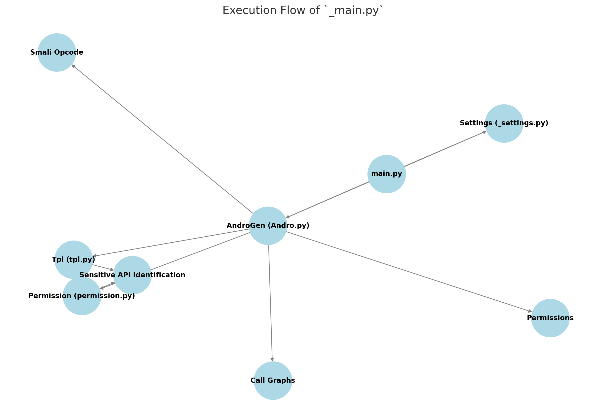

# **MsDroid Code Review**
برای مشاهده گیت‌هاب MsDroid به آدرس زیر می‌‌توان رجوع کرد:
[MsDroid (TDSC'22)](https://github.com/E0HYL/MsDroid)

# Preprocess step
در ابتدا به بررسی مرحلۀ preprocess می‌پردازیم. در گیت‌هاب MsDroid آمده است که برای آموزش مدل بر اساس دیتاست خود باید برنامۀ پایتونی `train.py` را اجرا نمود. همچنین اشاره شده است که به صورت زیر باید این فایل را به اجرا گذاشت:
```Bash
python3 train.py -i <input directory (APK dataset)>
```
البته که این اسکریپت پایتونی، آرگومان‌های دیگری به عنوان ورودی اخذ می‌کند که در ادامه به آن‌ها پرداخته می‌شود. پس در ابتدا به بررسی مسیر اجرای یک این اسکریپت برای یک دایرکتوری از APKها می‌پردازیم. در گام اول یک دایرکتوری متشکل از 3 فایل APK از دیتاست Androzoo را در نظر می‌گیریم. آدرس این دایرکتوری در سیستم خود برابر است با:
```Bash
/home/user/MsDroid2/APKs/Test_DB
```
## فعلا کمی از train.py
در این اسکریپت در ابتدا دو آدرس تنظیم می‌شوند که در ادامه بسیار کاربردی هستند:
```Bash
exp_base = './training/Experiments'
graph_base = f'./training/Graphs'
```
در ادامه یکی از آگومان‌های ورودی این اسکریپت output است که به صورت پیش‌فرض دایرکتوری Output از همان دایرکتوری است که اسکریپت در آن قرار دارد. برای مثال در سیستم ما به این صورت است:
```Bash
/home/user/MsDroid2/MsDroid-main/src/Output
```
نکته بعدی آرگومان label است که به صورت پیش‌فرض برابر با 1 در نظر گرفته شده است و منظور آن است که به صورت پیش‌فرض malware در نظر گرفته می‌شود. (این label برای دیتاست APK در نظر گرفته می‌شود)
یکی از دایرکتوری‌هایی که بسیار مهم است، `apk_base` است و این دایرکتوری فولدری را که فولدرهای (دیتاست‌های) شامل APKها را شامل می‌شود، معرفی می‌کند. یعنی در مثال سیستم ما این دایرکتوری برابر است با:
```Bash
/home/user/MsDroid2/APKs
```
همچنین نام دیتاست هم در داخل `db_name` ذخیره می‌گردد. در مثال ما `Test_DB` نام دیتاست ما می‌باشد.
### Experiment
برای هر آزمایش یا همان experiment، یک فایل و دایرکتوری ایجاد می‌شود. آدرس این دایرکتوری به صورت زیر است:
```python
exp_dir = f'./training/Graphs/{db_name}/HOP_{hop}/TPL_{tpl}'
```
همانطور که مشاهده می‌گردد، دایرکتوری `training` که مسئول ذخیره اطلاعات آموزش شبکه عصبی است، اطلاعات گره‌های بوجود آمده را ذخیره می‌نماید. 
در `train.py` مشاهده می‌گردد که یک شرط وجود دارد و به صورت زیر است:
```python
if not os.path.exists(f'{exp_dir}/dataset.pt'):
        makedirs('Mappings')
        import time
        T1 = time.process_time()    
        '''
        ./training/Graphs/<db_name>/processed/data_<apk_id>_<subgraph_id>.pt
        '''
        num_apk = generate_behavior_subgraph(apk_base, db_name, output_dir, args.deepth, label, hop=hop, tpl=tpl, training=True, api_map=True)
        T2 = time.process_time()
        print(f'Generate Behavior Subgraphs for {num_apk} APKs: {T2-T1}')
        testonly = True if num_apk==1 else False
```
در کد بالا، ابتدا بررسی می‌کند که آیا `dataset.pt` وجود دارد یا خیر! اگر وجود نداشت، دایرکتوری `Mappings` را درون دایرکتوری اصلی می‌سازد. در ادامه با استفاده از تابع `generate_behavior_subgraph()`، زیرگراف‌های رفتاری را می‌سازد و در دایرکتوری زیر ذخیره می‌سازد:
```bash
./training/Graphs/<db_name>/processed/
```
زیرگراف‌ها در فرمت `pt.*` ذخیره می‌شوند که برای آن است که در ساختارهای PyTorch ای استفاده شوند. نام این فایل‌ها به صورت زیر است:
```bash
data_<apk_id>_<subgraph_id>.pt
```
این نام‌گذاری نشان می‌دهد که هر فایل APK یک apk_id دریافت می‌کند و هر زیرگراف از هر فایل APK نیز یک ID مخصوص به خود دریافت می‌کند.
> نکته‌ای که وجود دارد آن است که وقتی هم‌اکنون اسکریپت را اجرا می‌کنیم، تابع `generate_behavior_subgraph()` را به طور کامل درست اجرا نمی‌کند و در میانۀ آن خطا دارد!

در `train.py` توابع دیگری نیز وجود دارد و همۀ توابع باید بررسی شوند. در موقع آن‌ها نام این توابع به میان خواهد آمد و چگونگی عملکرد آن‌ها بررسی خواهد شد! به همین دلیل هم‌اکنون به بررسی `generate_behavior_subgraph()` پرداخته می‌شود.
#زیرگراف #تولید #subgraph
## درود بر `generate_behavior_subgraph`
این تابع در فایل `main.py` تعریف شده است. کد این تابع به صورت زیر است:
```python
def generate_behavior_subgraph(apk_base, db_name, output_dir, deepth, label, hop=2, tpl=True, training=False, api_map=False):
    '''
    <output_dir>/<db_name>/decompile/<apk_name>/call.gml
    <output_dir>/<db_name>/result/<permission | opcode | tpl>/<apk_name>.csv
    '''
    call_graphs = generate_feature(apk_base, db_name, output_dir, deepth)   # `.gml`
    call_graphs.sort()
    print("call graph", call_graphs)
    '''
    <output_dir>/<db_name>/processed/data_<apk_id>_<subgraph_id>.pt
    '''
    gml_base = f'{output_dir}/{db_name}'
    generate_graph(call_graphs, output_dir, gml_base, db_name, label, hop, tpl, training, api_map)
    return call_graphs
```
این تابع وظیفه آن را دارد که فایل‌ها call graph را ایجاد کند. همچنین نتیجه استخراج ویژگی‌های یک APK را در دایرکتوری‌های زیر ذخیره می‌کند:
```bash
<output_dir>/<db_name>/result/tpl/<apk_name>.csv
<output_dir>/<db_name>/result/opcode/<apk_name>.csv
<output_dir>/<db_name>/result/permission/<apk_name>.csv
```
تابعی که وظیفه ایجاد فایل‌های بالا را بر عهده دارد، `generate_features()` است. 
ما قبل‌تر اشاره کردیم که زیرگراف‌ها در تابع `generate_behavior_subgraph()` تولید می‌گردند. در واقع تابعی که وظیفه اصلی ایجاد این زیرگراف‌ها را برعهده دارد، `generate_graph()` است. این تابع آرگومان‌هایی مانند call graphها را به عنوان ورودی می‌گیرد و خروجی آن زیرگراف‌های ذخیره شده در دایرکتوری مخصوص به خود است. 
سوال اصلی اینجاست که چگونه featureها بدست می‌آیند؟ به همین منظور ابتدا به قسمت نظری در مقاله می‌پردازیم. برای دریافت مقاله می‌توان لینک روبرو را دنبال کرد: [لینک مقاله](https://ieeexplore.ieee.org/document/9762803)
## بدست آوردن ویژگی‌ها (!!features!!)
### نظری

معانی API یا همان API semantics از دو راه جمع می‌شوند:
1. با متمایز کردن APIهای مرتبط با permissionها (مجوزهای حساس) که با $V_{per}$ نمایش داده می‌شوند و منظور مجموعه‌ای است که شامل گره‌های حساس است. همچنین داریم که:
$$
V_{per} \subset V
$$
در MsDroid برای بدست آوردن این مجموعه از دو نگاشت API-permission به نام‌های PSCout و Axplorer استفاده می‌گردد.
هر چند اپلیکیشن‌های اندرویدی از عملیات‌های CRUD برای content providerها استفاده می‌کنند که معمولا به مجوزهای حساس دسترسی پیدا می‌کنند. برای مثال `content://mms` که نیاز به مجوز `READ_SMS` دارد. عملیات‌های CRUD توسط متدهایی از اینترفیس `ContentRsolver` هندل می‌شوند.
عملا MsDroid این متدها را هندل می‌کند و نگاشت API-permission را به صورت $M_{per}$ تکمیل می‌کند.

2. برای شناسایی APIهایی که به ماژول‌های کاربردی ایزوله مرتبط هستند از LibRadar استفاده می‌گردد تا TPL یا همان Third-Party Libraries درون اپلیکیشن‌ها شناسایی شود.


### عملی
این تابع در فایل `main.py_` در دایرکتوری زیر وجود دارد:
```bash
/home/user/MsDroid2/MsDroid-main/src/feature/
```
با بررسی استخراج ویژگی‌ها (features) می‌توانیم execution flow را به صورت تصویر زیر در نظر بگیریم:



در ابتدا به کد این تابع نگاهی می‌اندازیم:
```python
import os
from androguard.core.analysis import auto
from .Andro.Andro import AndroGen
def generate_feature(apk_base, db_name, output_dir, deepth):
    '''
    save files:
    <output_dir>/<db_name>/decompile/<apk_name>/call.gml
    <output_dir>/<db_name>/result/<permission | opcode | tpl>/<apk_name>.csv
    '''
    # return all complete paths for `call.gml`
    db_path = os.path.join(apk_base, db_name)
    print(db_path)
    cg_path = os.path.join(output_dir, db_name, "decompile")
    feature_path = os.path.join(output_dir, db_name, "result")
    settings = {
        # The directory `some/directory` should contain some APK files
        "my": AndroGen(APKpath=db_path, CGPath=cg_path, FeaturePath=feature_path, deepth=deepth),  # apkfile
        # Use the default Logger
        "log": auto.DefaultAndroLog,
        # Use maximum of 2 threads
        "max_fetcher": 2,
    }
    aa = auto.AndroAuto(settings)
    aa.go()
    aa.dump()
    myandro = aa.settings["my"]
    call_graphs = myandro.get_call_graphs()
    print("generate feature finished")
    return call_graphs
```
در این تابع، دایرکتوری `db_path` بوجود می‌آید که عبارت است از جمع `apk_base` و `db_name`!  در این مثال ما، `db_path` برابر است با:
```bash
/home/user/MsDroid2/APKs/Test_DB
```
در ادامه آدرس دایرکتوری `cg_path` تولید می‌گردد که برابر است با:
```bash
<output_dir>/<db_name>/decompile/
```
در این دایرکتوری، فایل call graph ذخیره می‌گردد.
پس از آن، آدرس دایرکتوری `feature_path` تولید می‌گردد که برابر است با:
```bash
<output_dir>/<db_name>/result/
```
برای آنالیز فایل‌های APK از کتابخانه پایتونی Androguard استفاده می‌گردد. کلاس `AndroAuto` اینچنین است که بر اساس تنظیمات آن (settings در اینجا) تحلیلی انجام می‌دهد. در واقع کلاس `AndroGen` وظیفه اصلی این تحلیل را برعهده دارد. در انتها نیز call graphها به عنوان خروجی، return می‌گردند.
خروجی این تابع که همان call graphها هستند را یک بار نمایش می‌دهیم:
```bash
 ['/home/user/MsDroid2/MsDroid-main/src/Output/Test_DB/decompile/1aa440d4f99f709345b44484edd0d31aad29f5c5e00201be6d222fc16a896720/call.gml', '/home/user/MsDroid2/MsDroid-main/src/Output/Test_DB/decompile/1EC3CAC448F523E6286176C6CF12BC1BD3EE485445B4A428FC2655DDBFE505F3/call.gml', '/home/user/MsDroid2/MsDroid-main/src/Output/Test_DB/decompile/2b28128271d07a1e31f3a4eb8318886fba9becd9f1125833aaea5eb89d85ee47/call.gml']
```
حال به بررسی کلاس `AndroGen` می‌پردازیم.
هدف آن است که بفهمیم چگونه این ویژگی‌ها (features) تولید می‌شوند. حال یا درون کلاس `AndroGen` تولید خواهند شد یا این که از طریق تابع `generate_graph()` بدست خواهند آمد.

### **`AndroGen`**
این کلاس در فایل پایتونی `Andro.py` در دایرکتوری زیر قرار دارد:
```bash
/home/user/MsDroid2/MsDroid-main/src/feature/Andro/
```
کد این کلاس عبارت است از:
```python
import csv
import os
import sys
from collections import defaultdict
import networkx as nx
from androguard.core.analysis import auto
from androguard.decompiler.decompiler import DecompilerDAD
from . import _settings
from .permission import Permission
from .tpl import Tpl
from feature.Utils import utils
import re

# Functionality: opcode generation, call graph generation, mapping between generation and parenting

class AndroGen(auto.DirectoryAndroAnalysis):
    def __init__(self, APKpath, CGPath, FeaturePath, deepth):
        self.replacemap = {'Landroid/os/AsyncTask;': ['onPreExecute', 'doInBackground'],
                           'Landroid/os/Handler;': ['handleMessage'], 'Ljava/lang/Runnable;': ['run']}
        super(AndroGen, self).__init__(APKpath)
        self.APKPath = APKpath
        self.has_crashed = False
        self.CGPath = CGPath
        self.FeaturePath = FeaturePath
        self.smali_opcode = self.get_smaliOpcode(_settings.smaliOpcodeFilename)
        self.permission = []
        with open(_settings.headerfile) as f:
            self.permission = eval(f.read())
        self.cppermission = self.get_permission()
        self.call_graphs = []
        self.count = 0
        self.deepth = deepth

    def get_smaliOpcode(self, filename):  # read all smali opcode list
        opcode = list()
        with open(filename, 'r') as fileObject:
            lines = fileObject.readlines()
        for line in lines:
            opcode.append(line.rstrip('\n'))
        return opcode

    def get_permission(self):
        filename = _settings.cppermissiontxt
        permission = {}
        with open(filename) as f:
            content = f.readline().strip('\n')
            while content:
                cons = content.split(' ')
                if cons[0] not in permission:
                    permission[cons[0]] = set()
                permission[cons[0]].add((cons[1], 'Permission:' + cons[2]))
                content = f.readline().strip('\n')
        return permission

    def analysis_app(self, log, apkobj, dexobj, analysisobj):
        dexobj.set_decompiler(DecompilerDAD(dexobj, analysisobj))
        apk_filename = log.filename
        CGpath = apk_filename.replace(self.APKPath, self.CGPath)[:-4]
        CGfilename = os.path.join(CGpath, "call.gml")
        if not os.path.exists(CGpath):
            try:
                os.makedirs(CGpath)
            except Exception:
                pass
        opcodeFilename = apk_filename.replace(self.APKPath, self.FeaturePath + "/opcode").replace(".apk", ".csv")
        opcodePath = opcodeFilename[:opcodeFilename.rfind('/')]
        if not os.path.exists(opcodePath):
            try:
                os.makedirs(opcodePath)
            except Exception:
                pass
        permissionFilename = apk_filename.replace(self.APKPath, self.FeaturePath + "/permission").replace(".apk",".csv")
        permissionPath = permissionFilename[:permissionFilename.rfind('/')]
        if not os.path.exists(permissionPath):
            try:
                os.makedirs(permissionPath)
            except Exception:
                pass
        tplFilename = apk_filename.replace(self.APKPath, self.FeaturePath + "/tpl").replace(".apk", ".csv")
        tplPath = tplFilename[:tplFilename.rfind('/')]
        if not os.path.exists(tplPath):
            try:
                os.makedirs(tplPath)
            except Exception:
                pass
        if not os.path.exists(CGfilename):
            G = analysisobj.get_call_graph()  # call graph
            nx.write_gml(G, CGfilename, stringizer=str)  # save the call graph
        self.call_graphs.append(CGfilename)
        G = nx.read_gml(CGfilename, label='id')
        if os.path.exists(tplFilename):
            return
        opcodeFile = utils.create_csv(self.smali_opcode, opcodeFilename)
        method2nodeMap = self.getMethod2NodeMap(G)
        if method2nodeMap == {}:
            _settings.logger.error("%s has call graph error"%log.filename)
            print("%s has call graph error"%log.filename)
            return
        class_functions = defaultdict(list)  # mappings of class and its functions
        super_dic = {}  # mappings of class and its superclass(for class replacement)
        implement_dic = {}

        for classes in analysisobj.get_classes():  # all class
            class_name = str(classes.get_class().get_name())
            if classes.extends != "Ljava/lang/Object;":
                super_dic[class_name] = str(classes.extends)
                if str(classes.extends) in self.replacemap:
                    implement_dic[class_name] = str(classes.extends)
            if classes.implements:
                for imp in classes.implements:
                    if str(imp) in self.replacemap:
                        implement_dic[class_name] = str(imp)
            for method in classes.get_methods():
                if method.is_external():
                    continue
                m = method.get_method()
                class_functions[class_name].append(str(m.full_name))
                c = defaultdict(int)
                flag = False
                for ins in m.get_instructions():  # count
                    flag = True  # exist instructions
                    c[ins.get_name()] += 1
                opcode = {}
                for p in self.smali_opcode:
                    opcode[p] = 0
                for op in c:
                    if op in self.smali_opcode:
                        opcode[op] += c[op]
                if flag:
                    try:
                        utils.write_csv(opcode, opcodeFile, method2nodeMap[str(m.full_name)][0])
                    except Exception:
                        print("apk: %s, method: %s not exists"%(log.filename, str(m.full_name)))
        opcodeFile.close(
        cpermission = Permission(G=G, path=permissionFilename, class_functions=class_functions, super_dic=super_dic,
                                 implement_dic=implement_dic, dexobj=dexobj, permission=self.permission, cppermission=self.cppermission, method2nodeMap=method2nodeMap)
        cpermission.generate()
        class2init = cpermission.getClass2init()
        sensitiveapimap = cpermission.getsensitive_api()
        ctpl = Tpl(log.filename, G, tplFilename, sensitiveapimap, self.permission, class2init, self.deepth)
        ctpl.generate()


    def getMethod2NodeMap(self, G):
        method2nodeMap = {}
        try:
            node_attr = utils.df_from_G(G)
            labels = node_attr.label
            ids = node_attr.id
        except Exception:
            return method2nodeMap
        i = 0
        pattern = re.compile(r'&#(.+?);')
        while i < len(ids):
            nodeid = ids.get(i)
            label = labels.get(i)
            function = utils.node2function(label)
            rt = pattern.findall(function)
            for r in rt:
                function.replace("&#%s;"%r, chr(int(r)))
            method = function.replace(";->", "; ").replace("(", " (")
            method2nodeMap.update({method: (nodeid, function)})
            i = i + 1
        return method2nodeMap

  

    def get_call_graphs(self):
        return self.call_graphs
  

    def finish(self, log):
        # This method can be used to save information in `log`
        # finish is called regardless of a crash, so maybe store the
        # information somewhere
        if self.has_crashed:
            _settings.logger.debug("Analysis of {} has finished with Errors".format(log))
            print("Analysis of %s has finished with Errors, %d"%(log.filename, self.count))
        else:
            _settings.logger.info("Analysis of {} has finished!".format(log))
            print("Analysis of %s has finished!, %d"%(log.filename, self.count))
        self.count = self.count + 1

    def crash(self, log, why):
        # If some error happens during the analysis, this method will be
        # called
        self.has_crashed = True
        _settings.logger.debug("Error during analysis of {}: {}".format(log, why), file=sys.stderr)
```

قبل از پرداختن به جزئیات قسمت‌های مختلف این کلاس، مرور کلی بر عملکرد این کلاس خواهیم داشت.

- **اصلی‌ترین بخش تجزیه و تحلیل: `Analysis_app (log, apkobj, dexobj, analysisobj)

	 دایرکتوری‌هایی را برای ذخیره گراف‌های فراخوانی، کدهای عملیاتی(opcodes)، مجوزها و الگوها ایجاد می‌کند.
	 گراف فراخوانی را با استفاده از شی تجزیه و تحلیل (analysisobj) استخراج می‌کند و آن را با فرمت gml. با استفاده از networkx ذخیره می‌کند.
	 کدهای عملیاتی را برای هر روش در APK استخراج می‌کند و آن‌ها را به گره‌های مربوطه در گراف فراخوانی نگاشت می‌کند.
	 کلاس Permission را برای ایجاد نقشه‌های (نگاشت‌های) مجوز و کلاس Tpl را برای استخراج نگاشت‌های API حساس فراخوانی می‌کند.

- **تابع getMethod2NodeMap(G)** 
	یک نگاشت بین متدها و گره‌های مربوط به آن‌ها در گراف فراخوانی ایجاد می‌کند.

### در ابتدا init
باید بر این بخش تفصیلی ارائه گردد. در ابتدا باید بر کد این بخش مروری صورت گیرد که معادل است با:
```python
def __init__(self, APKpath, CGPath, FeaturePath, deepth):
        self.replacemap = {'Landroid/os/AsyncTask;': ['onPreExecute', 'doInBackground'],
                           'Landroid/os/Handler;': ['handleMessage'], 'Ljava/lang/Runnable;': ['run']}
        super(AndroGen, self).__init__(APKpath)
        self.APKPath = APKpath
        self.has_crashed = False
        self.CGPath = CGPath
        self.FeaturePath = FeaturePath
        self.smali_opcode = self.get_smaliOpcode(_settings.smaliOpcodeFilename)
        self.permission = []
        with open(_settings.headerfile) as f:
            self.permission = eval(f.read())
        self.cppermission = self.get_permission()
        self.call_graphs = []
        self.count = 0
        self.deepth = deepth
```
در ابتدا یک جایگزینی صورت می‌پذیرد که برابر است با:
```python
self.replacemap = {'Landroid/os/AsyncTask;': ['onPreExecute', 'doInBackground'],
                           'Landroid/os/Handler;': ['handleMessage'], 'Ljava/lang/Runnable;': ['run']}
```
اما خب این به چه معنا است؟! 

در واقع این نگاشت جایگزینی (replacement) برای هندل کردن کامپوننت‌های اندرویدی استفاده می‌شود که از الگوی خاصی در طراحی پیروی می‌کنند. در واقع کامپوننت‌های `AsyncTask`، `Handler` و `Runnable` متدهایی دارند که قابلیت اجرای asynchronously را دارا هستند و یا این که override می‌شوند و تسک خاصی را انجام می‌دهند. این متدها برای فهم عملکرد اپلیکیشن‌های اندرویدی حیاتی هستند، به خصوص در آنالیز عملیات‌های حیاتی API callها! 
یک مثال می‌تواند راحت‌تر موضوع را بیان کند:
```java
public class MyAsyncTask extends AsyncTask<Void, Void, Void> {
    @Override
    protected void onPreExecute() {
        // Pre-task setup
    }

    @Override
    protected Void doInBackground(Void... params) {
        // Sensitive API call
        ContentResolver.query(Uri.parse("content://sms"), null, null, null, null);
        return null;
    }

    @Override
    protected void onPostExecute(Void result) {
        // Post-task actions
    }
}
```
در این مثال، اپلیکیشن اندرویدی از `AsyncTask` استفاده می‌کند تا یک فعالیت حساس (خواندن `content://sms`) را به صورت غیرهمزمان در background انجام دهد. 
بررسی می‌کنیم اگر بدون replacement آنالیز صورت بگیرد چه می‌شود!
- شاید call graph نتواند `doInBackground` را به عنوان یک گره حساس تشخیص دهد.
- عملا API call های حساس را از دست بدهیم. زیرا به دلیل وراثت دچار عمق شده‌اند!
اگر این نگاشت لحاظ گردد خواهیم داشت:
```plaintext
node0 [label="MyAsyncTask->doInBackground"]
edge [source=0 target=ContentResolver.query]
```

#### **و برمی‌گردیم به تابع init** 
در یک خط از این قسمت از `init()` داریم که:
```python
self.smali_opcode = self.get_smaliOpcode(_settings.smaliOpcodeFilename)
```
عملا یک فایل config را تنظیم می‌کند. خروجی این خط از کد را بررسی می‌کنیم.
```bash
>>> ['nop', 'move', 'move/from16', 'move/16', 'move-wide', 'move-wide/from16', 'move-wide/16', 'move-object', 'move-object/from16', 'move-object/16', 'move-result', 'move-result-wide', 'move-result-object', 'move-exception', 'return-void', 'return', 'return-wide', 'return-object', 'const/4', 'const/16', 'const', 'const/high16', 'const-wide/16', 'const-wide/32', 'const-wide', 'const-wide/high16', 'const-string', 'const-string/jumbo', 'const-class', 'monitor-enter', 'monitor-exit', 'check-cast', 'instance-of', 'array-length', 'new-instance', 'new-array', 'filled-new-array', 'filled-new-array/range', 'filled-array-data', 'throw', 'goto', 'goto/16', 'goto/32', 'packed-switch', 'sparse-switch', 'cmpl-float', 'cmpg-float', 'cmpl-double', 'cmpg-double', 'cmp-long', 'if-eq', 'if-ne', 'if-lt', 'if-ge', 'if-gt', 'if-le', 'if-eqz', 'if-nez', 'if-ltz', 'if-gez', 'if-gtz', 'if-lez', 'aget', 'aget-wide', 'aget-object', 'aget-boolean', 'aget-byte', 'aget-char', 'aget-short', 'aput', 'aput-wide', 'aput-object', 'aput-boolean', 'aput-byte', 'aput-char', 'aput-short', 'iget', 'iget-wide', 'iget-object', 'iget-boolean', 'iget-byte', 'iget-char', 'iget-short', 'iput', 'iput-wide', 'iput-object', 'iput-boolean', 'iput-byte', 'iput-char', 'iput-short', 'sget', 'sget-wide', 'sget-object', 'sget-boolean', 'sget-byte', 'sget-char', 'sget-short', 'sput', 'sput-wide', 'sput-object', 'sput-boolean', 'sput-byte', 'sput-char', 'sput-short', 'invoke-virtual', 'invoke-super', 'invoke-direct', 'invoke-static', 'invoke-interface', 'invoke-virtual/range', 'invoke-super/range', 'invoke-direct/range', 'invoke-static/range', 'invoke-interface/range', 'neg-int', 'not-int', 'neg-long', 'not-long', 'neg-float', 'neg-double', 'int-to-long', 'int-to-float', 'int-to-double', 'long-to-int', 'long-to-float', 'long-to-double', 'float-to-int', 'float-to-long', 'float-to-double', 'double-to-int', 'double-to-long', 'double-to-float', 'int-to-byte', 'int-to-char', 'int-to-short', 'add-int', 'sub-int', 'mul-int', 'div-int', 'rem-int', 'and-int', 'or-int', 'xor-int', 'shl-int', 'shr-int', 'ushr-int', 'add-long', 'sub-long', 'mul-long', 'div-long', 'rem-long', 'and-long', 'or-long', 'xor-long', 'shl-long', 'shr-long', 'ushr-long', 'add-float', 'sub-float', 'mul-float', 'div-float', 'rem-float', 'add-double', 'sub-double', 'mul-double', 'div-double', 'rem-double', 'add-int/2addr', 'sub-int/2addr', 'mul-int/2addr', 'div-int/2addr', 'rem-int/2addr', 'and-int/2addr', 'or-int/2addr', 'xor-int/2addr', 'shl-int/2addr', 'shr-int/2addr', 'ushr-int/2addr', 'add-long/2addr', 'sub-long/2addr', 'mul-long/2addr', 'div-long/2addr', 'rem-long/2addr', 'and-long/2addr', 'or-long/2addr', 'xor-long/2addr', 'shl-long/2addr', 'shr-long/2addr', 'ushr-long/2addr', 'add-float/2addr', 'sub-float/2addr', 'mul-float/2addr', 'div-float/2addr', 'rem-float/2addr', 'add-double/2addr', 'sub-double/2addr', 'mul-double/2addr', 'div-double/2addr', 'rem-double/2addr', 'add-int/lit16', 'rsub-int', 'mul-int/lit16', 'div-int/lit16', 'rem-int/lit16', 'and-int/lit16', 'or-int/lit16', 'xor-int/lit16', 'add-int/lit8', 'rsub-int/lit8', 'mul-int/lit8', 'div-int/lit8', 'rem-int/lit8', 'and-int/lit8', 'or-int/lit8', 'xor-int/lit8', 'shl-int/lit8', 'shr-int/lit8', 'ushr-int/lit8', 'invoke-polymorphic', 'invoke-polymorphic/range', 'invoke-custom', 'invoke-custom/range', 'const-method-handle', 'const-method-type']
```
این opcode ها تنها بخشی از opcode های Android Dalvik نیستند بلکه تمام opcode ها هستند. پس فقط بخشی از opcode ها به عنوان حساس در نظر گرفته نشده‌اند و استخراج اطلاعات مربوط به تمامی opcode ها مدنظر است! 
تعداد این opcode ها برابر 224 است! -> کل opcode های Android Dalvik

در ادامه تابع `init()` به قسمتی از کد می‌رسیم که برابر است با:
```python
with open(_settings.headerfile) as f:
	self.permission = eval(f.read())
```
نتیجه اجرای این قسمت از کد برابر است با:
```bash
['Permission:android.car.permission.CAR_CAMERA', 'Permission:android.car.permission.CAR_HVAC', 'Permission:android.car.permission.CAR_MOCK_VEHICLE_HAL', 'Permission:android.car.permission.CAR_NAVIGATION_MANAGER', 'Permission:android.car.permission.CAR_PROJECTION', 'Permission:android.car.permission.CAR_RADIO', 'Permission:android.car.permission.CONTROL_APP_BLOCKING', 'Permission:android.permission.ACCESS_ALL_DOWNLOADS', 'Permission:android.permission.ACCESS_ALL_EXTERNAL_STORAGE', 'Permission:android.permission.ACCESS_BLUETOOTH_SHARE', 'Permission:android.permission.ACCESS_CACHE_FILESYSTEM', 'Permission:android.permission.ACCESS_COARSE_LOCATION', 'Permission:android.permission.ACCESS_CONTENT_PROVIDERS_EXTERNALLY', 'Permission:android.permission.ACCESS_DOWNLOAD_MANAGER', 'Permission:android.permission.ACCESS_DOWNLOAD_MANAGER_ADVANCED', 'Permission:android.permission.ACCESS_DRM', 'Permission:android.permission.ACCESS_FINE_LOCATION', 'Permission:android.permission.ACCESS_KEYGUARD_SECURE_STORAGE', 'Permission:android.permission.ACCESS_LOCATION_EXTRA_COMMANDS', 'Permission:android.permission.ACCESS_MOCK_LOCATION', 'Permission:android.permission.ACCESS_NETWORK_STATE', 'Permission:android.permission.ACCESS_NOTIFICATIONS', 'Permission:android.permission.ACCESS_VOICE_INTERACTION_SERVICE', 'Permission:android.permission.ACCESS_WIFI_STATE', 'Permission:android.permission.ACCOUNT_MANAGER', 'Permission:android.permission.ASEC_ACCESS', 'Permission:android.permission.ASEC_CREATE', 'Permission:android.permission.ASEC_DESTROY', 'Permission:android.permission.ASEC_MOUNT_UNMOUNT', 'Permission:android.permission.ASEC_RENAME', 'Permission:android.permission.AUTHENTICATE_ACCOUNTS', 'Permission:android.permission.BACKUP', 'Permission:android.permission.BATTERY_STATS', 'Permission:android.permission.BIND_APPWIDGET', 'Permission:android.permission.BIND_CARRIER_SERVICES', 'Permission:android.permission.BIND_DEVICE_ADMIN', 'Permission:android.permission.BIND_VOICE_INTERACTION', 'Permission:android.permission.BLUETOOTH', 'Permission:android.permission.BLUETOOTH_ADMIN', 'Permission:android.permission.BLUETOOTH_PRIVILEGED', 'Permission:android.permission.BROADCAST_NETWORK_PRIVILEGED', 'Permission:android.permission.BROADCAST_SCORE_NETWORKS', 'Permission:android.permission.BROADCAST_STICKY', 'Permission:android.permission.CACHE_CONTENT', 'Permission:android.permission.CALL_PHONE', 'Permission:android.permission.CALL_PRIVILEGED', 'Permission:android.permission.CAMERA', 'Permission:android.permission.CAPTURE_AUDIO_OUTPUT', 'Permission:android.permission.CAPTURE_SECURE_VIDEO_OUTPUT', 'Permission:android.permission.CAPTURE_TV_INPUT', 'Permission:android.permission.CAPTURE_VIDEO_OUTPUT', 'Permission:android.permission.CHANGE_APP_IDLE_STATE', 'Permission:android.permission.CHANGE_COMPONENT_ENABLED_STATE', 'Permission:android.permission.CHANGE_CONFIGURATION', 'Permission:android.permission.CHANGE_DEVICE_IDLE_TEMP_WHITELIST', 'Permission:android.permission.CHANGE_NETWORK_STATE', 'Permission:android.permission.CHANGE_WIFI_MULTICAST_STATE', 'Permission:android.permission.CHANGE_WIFI_STATE', 'Permission:android.permission.CLEAR_APP_CACHE', 'Permission:android.permission.CLEAR_APP_GRANTED_URI_PERMISSIONS', 'Permission:android.permission.CLEAR_APP_USER_DATA', 'Permission:android.permission.CONFIGURE_DISPLAY_COLOR_MODE', 'Permission:android.permission.CONFIGURE_DISPLAY_COLOR_TRANSFORM', 'Permission:android.permission.CONFIGURE_WIFI_DISPLAY', 'Permission:android.permission.CONFIRM_FULL_BACKUP', 'Permission:android.permission.CONNECTIVITY_INTERNAL', 'Permission:android.permission.CONNECTIVITY_USE_RESTRICTED_NETWORKS', 'Permission:android.permission.CONTROL_LOCATION_UPDATES', 'Permission:android.permission.CONTROL_VPN', 'Permission:android.permission.CRYPT_KEEPER', 'Permission:android.permission.DELETE_CACHE_FILES', 'Permission:android.permission.DELETE_PACKAGES', 'Permission:android.permission.DEVICE_POWER', 'Permission:android.permission.DISABLE_KEYGUARD', 'Permission:android.permission.DOWNLOAD_CACHE_NON_PURGEABLE', 'Permission:android.permission.DOWNLOAD_WITHOUT_NOTIFICATION', 'Permission:android.permission.DUMP', 'Permission:android.permission.DVB_DEVICE', 'Permission:android.permission.EXPAND_STATUS_BAR', 'Permission:android.permission.FILTER_EVENTS', 'Permission:android.permission.FLASHLIGHT', 'Permission:android.permission.FORCE_BACK', 'Permission:android.permission.FORCE_STOP_PACKAGES', 'Permission:android.permission.FRAME_STATS', 'Permission:android.permission.FREEZE_SCREEN', 'Permission:android.permission.GET_ACCOUNTS', 'Permission:android.permission.GET_APP_GRANTED_URI_PERMISSIONS', 'Permission:android.permission.GET_APP_OPS_STATS', 'Permission:android.permission.GET_DETAILED_TASKS', 'Permission:android.permission.GET_INTENT_SENDER_INTENT', 'Permission:android.permission.GET_PACKAGE_SIZE', 'Permission:android.permission.GET_PROCESS_STATE_AND_OOM_SCORE', 'Permission:android.permission.GET_TASKS', 'Permission:android.permission.GET_TOP_ACTIVITY_INFO', 'Permission:android.permission.GLOBAL_SEARCH', 'Permission:android.permission.GRANT_REVOKE_PERMISSIONS', 'Permission:android.permission.GRANT_RUNTIME_PERMISSIONS', 'Permission:android.permission.HDMI_CEC', 'Permission:android.permission.INSTALL_DRM', 'Permission:android.permission.INSTALL_GRANT_RUNTIME_PERMISSIONS', 'Permission:android.permission.INSTALL_LOCATION_PROVIDER', 'Permission:android.permission.INSTALL_PACKAGES', 'Permission:android.permission.INTENT_FILTER_VERIFICATION_AGENT', 'Permission:android.permission.INTERACT_ACROSS_USERS', 'Permission:android.permission.INTERACT_ACROSS_USERS_FULL', 'Permission:android.permission.INTERNAL_SYSTEM_WINDOW', 'Permission:android.permission.INTERNET', 'Permission:android.permission.KILL_BACKGROUND_PROCESSES', 'Permission:android.permission.KILL_UID', 'Permission:android.permission.LOCAL_MAC_ADDRESS', 'Permission:android.permission.LOCATION_HARDWARE', 'Permission:android.permission.MAGNIFY_DISPLAY', 'Permission:android.permission.MANAGE_ACCOUNTS', 'Permission:android.permission.MANAGE_ACTIVITY_STACKS', 'Permission:android.permission.MANAGE_APP_OPS_RESTRICTIONS', 'Permission:android.permission.MANAGE_APP_TOKENS', 'Permission:android.permission.MANAGE_CA_CERTIFICATES', 'Permission:android.permission.MANAGE_DEVICE_ADMINS', 'Permission:android.permission.MANAGE_DOCUMENTS', 'Permission:android.permission.MANAGE_FINGERPRINT', 'Permission:android.permission.MANAGE_MEDIA_PROJECTION', 'Permission:android.permission.MANAGE_NETWORK_POLICY', 'Permission:android.permission.MANAGE_PROFILE_AND_DEVICE_OWNERS', 'Permission:android.permission.MANAGE_SOUND_TRIGGER', 'Permission:android.permission.MANAGE_USB', 'Permission:android.permission.MANAGE_USERS', 'Permission:android.permission.MANAGE_VOICE_KEYPHRASES', 'Permission:android.permission.MARK_NETWORK_SOCKET', 'Permission:android.permission.MEDIA_CONTENT_CONTROL', 'Permission:android.permission.MODIFY_APPWIDGET_BIND_PERMISSIONS', 'Permission:android.permission.MODIFY_AUDIO_ROUTING', 'Permission:android.permission.MODIFY_AUDIO_SETTINGS', 'Permission:android.permission.MODIFY_NETWORK_ACCOUNTING', 'Permission:android.permission.MODIFY_PARENTAL_CONTROLS', 'Permission:android.permission.MODIFY_PHONE_STATE', 'Permission:android.permission.MOUNT_FORMAT_FILESYSTEMS', 'Permission:android.permission.MOUNT_UNMOUNT_FILESYSTEMS', 'Permission:android.permission.MOVE_PACKAGE', 'Permission:android.permission.NFC', 'Permission:android.permission.NOTIFY_PENDING_SYSTEM_UPDATE', 'Permission:android.permission.OBSERVE_GRANT_REVOKE_PERMISSIONS', 'Permission:android.permission.PACKAGE_USAGE_STATS', 'Permission:android.permission.PACKAGE_VERIFICATION_AGENT', 'Permission:android.permission.PACKET_KEEPALIVE_OFFLOAD', 'Permission:android.permission.PEERS_MAC_ADDRESS', 'Permission:android.permission.PERSISTENT_ACTIVITY', 'Permission:android.permission.PROCESS_OUTGOING_CALLS', 'Permission:android.permission.QUERY_DO_NOT_ASK_CREDENTIALS_ON_BOOT', 'Permission:android.permission.READ_CALENDAR', 'Permission:android.permission.READ_CALL_LOG', 'Permission:android.permission.READ_CELL_BROADCASTS', 'Permission:android.permission.READ_CONTACTS', 'Permission:android.permission.READ_DREAM_STATE', 'Permission:android.permission.READ_EXTERNAL_STORAGE', 'Permission:android.permission.READ_FRAME_BUFFER', 'Permission:android.permission.READ_LOGS', 'Permission:android.permission.READ_NETWORK_USAGE_HISTORY', 'Permission:android.permission.READ_PHONE_STATE', 'Permission:android.permission.READ_PRECISE_PHONE_STATE', 'Permission:android.permission.READ_PRIVILEGED_PHONE_STATE', 'Permission:android.permission.READ_PROFILE', 'Permission:android.permission.READ_SEARCH_INDEXABLES', 'Permission:android.permission.READ_SMS', 'Permission:android.permission.READ_SOCIAL_STREAM', 'Permission:android.permission.READ_SYNC_SETTINGS', 'Permission:android.permission.READ_SYNC_STATS', 'Permission:android.permission.READ_USER_DICTIONARY', 'Permission:android.permission.READ_WIFI_CREDENTIAL', 'Permission:android.permission.REAL_GET_TASKS', 'Permission:android.permission.REBOOT', 'Permission:android.permission.RECEIVE_BLUETOOTH_MAP', 'Permission:android.permission.RECEIVE_BOOT_COMPLETED', 'Permission:android.permission.RECEIVE_MMS', 'Permission:android.permission.RECEIVE_SMS', 'Permission:android.permission.RECORD_AUDIO', 'Permission:android.permission.RECOVERY', 'Permission:android.permission.REGISTER_CONNECTION_MANAGER', 'Permission:android.permission.REGISTER_WINDOW_MANAGER_LISTENERS', 'Permission:android.permission.REMOTE_AUDIO_PLAYBACK', 'Permission:android.permission.REMOVE_TASKS', 'Permission:android.permission.REORDER_TASKS', 'Permission:android.permission.RESET_FINGERPRINT_LOCKOUT', 'Permission:android.permission.RESET_SHORTCUT_MANAGER_THROTTLING', 'Permission:android.permission.RESTART_PACKAGES', 'Permission:android.permission.RETRIEVE_WINDOW_INFO', 'Permission:android.permission.REVOKE_RUNTIME_PERMISSIONS', 'Permission:android.permission.SCORE_NETWORKS', 'Permission:android.permission.SEND_RESPOND_VIA_MESSAGE', 'Permission:android.permission.SEND_SMS', 'Permission:android.permission.SEND_SMS_NO_CONFIRMATION', 'Permission:android.permission.SERIAL_PORT', 'Permission:android.permission.SET_ACTIVITY_WATCHER', 'Permission:android.permission.SET_ALWAYS_FINISH', 'Permission:android.permission.SET_ANIMATION_SCALE', 'Permission:android.permission.SET_DEBUG_APP', 'Permission:android.permission.SET_INPUT_CALIBRATION', 'Permission:android.permission.SET_KEYBOARD_LAYOUT', 'Permission:android.permission.SET_ORIENTATION', 'Permission:android.permission.SET_POINTER_SPEED', 'Permission:android.permission.SET_PREFERRED_APPLICATIONS', 'Permission:android.permission.SET_PROCESS_LIMIT', 'Permission:android.permission.SET_SCREEN_COMPATIBILITY', 'Permission:android.permission.SET_TIME', 'Permission:android.permission.SET_TIME_ZONE', 'Permission:android.permission.SET_WALLPAPER', 'Permission:android.permission.SET_WALLPAPER_COMPONENT', 'Permission:android.permission.SET_WALLPAPER_HINTS', 'Permission:android.permission.SHUTDOWN', 'Permission:android.permission.SIGNAL_PERSISTENT_PROCESSES', 'Permission:android.permission.START_ANY_ACTIVITY', 'Permission:android.permission.START_TASKS_FROM_RECENTS', 'Permission:android.permission.STATUS_BAR', 'Permission:android.permission.STATUS_BAR_SERVICE', 'Permission:android.permission.STOP_APP_SWITCHES', 'Permission:android.permission.STORAGE_INTERNAL', 'Permission:android.permission.SYSTEM_ALERT_WINDOW', 'Permission:android.permission.TABLET_MODE', 'Permission:android.permission.TABLET_MODE_LISTENER', 'Permission:android.permission.TETHER_PRIVILEGED', 'Permission:android.permission.TRANSMIT_IR', 'Permission:android.permission.TV_INPUT_HARDWARE', 'Permission:android.permission.UPDATE_APP_OPS_STATS', 'Permission:android.permission.UPDATE_DEVICE_STATS', 'Permission:android.permission.UPDATE_LOCK', 'Permission:android.permission.USE_CREDENTIALS', 'Permission:android.permission.USE_FINGERPRINT', 'Permission:android.permission.USE_SIP', 'Permission:android.permission.VIBRATE', 'Permission:android.permission.WAKE_LOCK', 'Permission:android.permission.WRITE_APN_SETTINGS', 'Permission:android.permission.WRITE_CALENDAR', 'Permission:android.permission.WRITE_CALL_LOG', 'Permission:android.permission.WRITE_CONTACTS', 'Permission:android.permission.WRITE_DREAM_STATE', 'Permission:android.permission.WRITE_EXTERNAL_STORAGE', 'Permission:android.permission.WRITE_PROFILE', 'Permission:android.permission.WRITE_SECURE_SETTINGS', 'Permission:android.permission.WRITE_SETTINGS', 'Permission:android.permission.WRITE_SMS', 'Permission:android.permission.WRITE_SOCIAL_STREAM', 'Permission:android.permission.WRITE_SYNC_SETTINGS', 'Permission:android.permission.WRITE_USER_DICTIONARY', 'Permission:com.android.browser.permission.READ_HISTORY_BOOKMARKS', 'Permission:com.android.browser.permission.WRITE_HISTORY_BOOKMARKS', 'Permission:com.android.cts.permissionNormal', 'Permission:com.android.cts.permissionNotUsedWithSignature', 'Permission:com.android.cts.permissionWithSignature', 'Permission:com.android.email.permission.ACCESS_PROVIDER', 'Permission:com.android.email.permission.READ_ATTACHMENT', 'Permission:com.android.gallery3d.filtershow.permission.READ', 'Permission:com.android.gallery3d.filtershow.permission.WRITE', 'Permission:com.android.gallery3d.permission.GALLERY_PROVIDER', 'Permission:com.android.launcher.permission.READ_SETTINGS', 'Permission:com.android.launcher.permission.WRITE_SETTINGS', 'Permission:com.android.launcher3.permission.READ_SETTINGS', 'Permission:com.android.launcher3.permission.WRITE_SETTINGS', 'Permission:com.android.printspooler.permission.ACCESS_ALL_PRINT_JOBS', 'Permission:com.android.providers.imps.permission.READ_ONLY', 'Permission:com.android.providers.imps.permission.WRITE_ONLY', 'Permission:com.android.providers.tv.permission.READ_EPG_DATA', 'Permission:com.android.providers.tv.permission.WRITE_EPG_DATA', 'Permission:com.android.rcs.eab.permission.READ_WRITE_EAB', 'Permission:com.android.server.telecom.permission.REGISTER_PROVIDER_OR_SUBSCRIPTION', 'Permission:com.android.voicemail.permission.ADD_VOICEMAIL', 'Permission:getWindowToken', 'Permission:temporaryEnableAccessibilityStateUntilKeyguardRemoved', 'Permission:ti.permission.FMRX', 'Permission:ti.permission.FMRX_ADMIN']
```
خروجی این قسمت از کد نشان می‌دهد که این مجوزها که درون فایل `head.txt` قرار دارند، عملا زیرمجموعه‌ای از permission های اندرویدی هستند که **==حساس==** تلقی می‌گردند و برای تشخیص بدافزار و عمل‌های مخرب به کار می‌روند.

به ادامه تابع `init()` خواهیم پرداخت که به تکه کد زیر می‌رسیم:
```python
self.cppermission = self.get_permission()
```
خروجی این قسمت از کد عبارت است از:
```bash
{'content://browser': {('R', 'Permission:com.android.browser.permission.READ_HISTORY_BOOKMARKS'), ('W', 'Permission:com.android.browser.permission.WRITE_HISTORY_BOOKMARKS')}, 'content://com.android.browser': {('R', 'Permission:com.android.browser.permission.READ_HISTORY_BOOKMARKS'), ('W', 'Permission:com.android.browser.permission.WRITE_HISTORY_BOOKMARKS')}, 'content://cellbroadcasts': {('R', 'Permission:android.permission.READ_CELL_BROADCASTS')}, 'content://com.android.email.attachmentprovider': {('R', 'Permission:com.android.email.permission.READ_ATTACHMENT')}, 'content://com.android.email.notifier': {('W', 'Permission:com.android.email.permission.ACCESS_PROVIDER'), ('R', 'Permission:com.android.email.permission.ACCESS_PROVIDER')}, 'content://com.android.email.provider': {('W', 'Permission:com.android.email.permission.ACCESS_PROVIDER'), ('R', 'Permission:com.android.email.permission.ACCESS_PROVIDER')}, 'content://com.android.exchange.directory.provider': {('R', 'Permission:android.permission.READ_CONTACTS')}, 'content://com.android.launcher2.settings': {('W', 'Permission:com.android.launcher.permission.WRITE_SETTINGS'), ('R', 'Permission:com.android.launcher.permission.READ_SETTINGS')}, 'content://com.android.mms.SuggestionsProvider': {('R', 'Permission:android.permission.READ_SMS')}, 'content://icc': {('R', 'Permission:android.permission.READ_CONTACTS'), ('W', 'Permission:android.permission.WRITE_CONTACTS')}, 'content://com.android.calendar': {('W', 'Permission:android.permission.WRITE_CALENDAR'), ('R', 'Permission:android.permission.READ_CALENDAR')}, 'content://call_log': {('R', 'Permission:android.permission.READ_CONTACTS'), ('W', 'Permission:android.permission.WRITE_CALL_LOG'), ('W', 'Permission:android.permission.WRITE_CONTACTS'), ('R', 'Permission:android.permission.READ_CALL_LOG')}, 'content://com.android.contacts': {('R', 'Permission:android.permission.READ_CONTACTS'), ('W', 'Permission:android.permission.WRITE_CONTACTS')}, 'content://contacts': {('R', 'Permission:android.permission.READ_CONTACTS'), ('W', 'Permission:android.permission.WRITE_CONTACTS')}, 'content://com.android.voicemail': {('W', 'Permission:com.android.voicemail.permission.ADD_VOICEMAIL'), ('R', 'Permission:com.android.voicemail.permission.ADD_VOICEMAIL')}, 'content://settings': {('W', 'Permission:android.permission.WRITE_SETTINGS')}, 'content://mms': {('W', 'Permission:android.permission.WRITE_SMS'), ('R', 'Permission:android.permission.READ_SMS')}, 'content://mms-sms': {('W', 'Permission:android.permission.WRITE_SMS'), ('R', 'Permission:android.permission.READ_SMS')}, 'content://sms': {('W', 'Permission:android.permission.WRITE_SMS'), ('R', 'Permission:android.permission.READ_SMS')}, 'content://user_dictionary': {('R', 'Permission:android.permission.READ_USER_DICTIONARY'), ('W', 'Permission:android.permission.WRITE_USER_DICTIONARY')}, 'content://com.android.gallery3d.filtershow.provider.SharedImageProvider': {('W', 'Permission:com.android.gallery3d.filtershow.permission.WRITE'), ('R', 'Permission:com.android.gallery3d.filtershow.permission.READ')}, 'content://com.android.gallery3d.provider': {('W', 'Permission:com.android.gallery3d.permission.GALLERY_PROVIDER'), ('R', 'Permission:com.android.gallery3d.permission.GALLERY_PROVIDER')}, 'content://com.android.externalstorage.documents': {('W', 'Permission:android.permission.MANAGE_DOCUMENTS'), ('R', 'Permission:android.permission.MANAGE_DOCUMENTS')}, 'content://com.android.launcher3.settings': {('R', 'Permission:com.android.launcher3.permission.READ_SETTINGS'), ('W', 'Permission:com.android.launcher3.permission.WRITE_SETTINGS')}, 'content://com.android.providers.downloads.documents': {('W', 'Permission:android.permission.MANAGE_DOCUMENTS'), ('R', 'Permission:android.permission.MANAGE_DOCUMENTS')}, 'content://com.android.providers.media.documents': {('W', 'Permission:android.permission.MANAGE_DOCUMENTS'), ('R', 'Permission:android.permission.MANAGE_DOCUMENTS')}, 'content://com.android.cellbroadcastreceiver': {('W', 'Permission:android.permission.READ_SEARCH_INDEXABLES'), ('R', 'Permission:android.permission.READ_SEARCH_INDEXABLES')}, 'content://com.android.phone': {('W', 'Permission:android.permission.READ_SEARCH_INDEXABLES'), ('R', 'Permission:android.permission.READ_SEARCH_INDEXABLES')}, 'content://hbpcd_lookup': {('W', 'Permission:android.permission.MODIFY_PHONE_STATE')}, 'content://android.media.tv': {('R', 'Permission:com.android.providers.tv.permission.READ_EPG_DATA'), ('W', 'Permission:com.android.providers.tv.permission.WRITE_EPG_DATA')}, 'content://com.android.settings': {('W', 'Permission:android.permission.READ_SEARCH_INDEXABLES'), ('R', 'Permission:android.permission.READ_SEARCH_INDEXABLES')}, 'content://com.android.mtp.documents': {('W', 'Permission:android.permission.MANAGE_DOCUMENTS'), ('R', 'Permission:android.permission.MANAGE_DOCUMENTS')}, 'content://com.android.crashreportprovider': {('W', 'Permission:android.permission.READ_LOGS'), ('R', 'Permission:android.permission.READ_LOGS')}, 'content://call_log_shadow': {('W', 'Permission:android.permission.MANAGE_USERS'), ('R', 'Permission:android.permission.MANAGE_USERS')}, 'content://com.android.rcs.eab': {('W', 'Permission:com.android.rcs.eab.permission.READ_WRITE_EAB'), ('R', 'Permission:com.android.rcs.eab.permission.READ_WRITE_EAB')}, 'content://browser/bookmarks/search_suggest_query': {('R', 'Permission:android.permission.GLOBAL_SEARCH')}, 'content://com.android.bluetooth.opp/btopp': {('W', 'Permission:android.permission.ACCESS_BLUETOOTH_SHARE'), ('R', 'Permission:android.permission.ACCESS_BLUETOOTH_SHARE')}, 'content://com.android.contacts/contacts/.*/photo': {('R', 'Permission:android.permission.GLOBAL_SEARCH')}, 'content://com.android.contacts/search_suggest_query': {('R', 'Permission:android.permission.GLOBAL_SEARCH')}, 'content://com.android.contacts/search_suggest_shortcut': {('R', 'Permission:android.permission.GLOBAL_SEARCH')}, 'content://com.android.exchange.provider': {('W', 'Permission:com.android.email.permission.ACCESS_PROVIDER'), ('R', 'Permission:com.android.email.permission.ACCESS_PROVIDER')}, 'content://com.android.mms.SuggestionsProvider/search_suggest_query': {('R', 'Permission:android.permission.GLOBAL_SEARCH')}, 'content://com.android.mms.SuggestionsProvider/search_suggest_shortcut': {('R', 'Permission:android.permission.GLOBAL_SEARCH')}, 'content://com.android.social': {('R', 'Permission:android.permission.READ_CONTACTS'), ('W', 'Permission:android.permission.WRITE_CONTACTS')}, 'content://contacts/contacts/.*/photo': {('R', 'Permission:android.permission.GLOBAL_SEARCH')}, 'content://contacts/search_suggest_query': {('R', 'Permission:android.permission.GLOBAL_SEARCH')}, 'content://contacts/search_suggest_shortcut': {('R', 'Permission:android.permission.GLOBAL_SEARCH')}, 'content://ctspermissionwithsignature': {('R', 'Permission:com.android.cts.permissionWithSignature'), ('W', 'Permission:com.android.cts.permissionWithSignature')}, 'content://downloads': {('W', 'Permission:android.permission.ACCESS_ALL_DOWNLOADS'), ('R', 'Permission:android.permission.ACCESS_ALL_DOWNLOADS'), ('W', 'Permission:android.permission.ACCESS_DOWNLOAD_MANAGER'), ('R', 'Permission:android.permission.ACCESS_DOWNLOAD_MANAGER')}, 'content://imps': {('R', 'Permission:com.android.providers.imps.permission.READ_ONLY'), ('W', 'Permission:com.android.providers.imps.permission.WRITE_ONLY')}, 'content://ctspermissionwithsignaturegranting': {('R', 'Permission:com.android.cts.permissionWithSignature'), ('W', 'Permission:com.android.cts.permissionWithSignature')}, 'content://ctspermissionwithsignaturepath/foo': {('R', 'Permission:com.android.cts.permissionWithSignature')}, 'content://ctspermissionwithsignaturepath': {('R', 'Permission:com.android.cts.permissionNotUsedWithSignature'), ('W', 'Permission:com.android.cts.permissionNotUsedWithSignature')}, 'content://ctspermissionwithsignaturepath/yes': {('R', 'Permission:com.android.cts.permissionWithSignature')}, 'content://downloads/download': {('W', 'Permission:android.permission.INTERNET'), ('R', 'Permission:android.permission.INTERNET')}, 'content://downloads/my_downloads': {('W', 'Permission:android.permission.INTERNET'), ('R', 'Permission:android.permission.INTERNET')}, 'content://com.android.browser/bookmarks/search_suggest_query': {('R', 'Permission:android.permission.GLOBAL_SEARCH')}, 'content://com.android.browser.home': {('R', 'Permission:com.android.browser.permission.READ_HISTORY_BOOKMARKS')}, 'content://downloads/all_downloads': {('W', 'Permission:android.permission.ACCESS_ALL_DOWNLOADS'), ('R', 'Permission:android.permission.ACCESS_ALL_DOWNLOADS')}, 'content://ctspermissionwithsignaturepathrestricting/foo/bar': {('R', 'Permission:com.android.cts.permissionNormal')}, 'content://ctspermissionwithsignaturepathrestricting/foo': {('R', 'Permission:com.android.cts.permissionWithSignature')}, 'content://media/external/': {('R', 'Permission:android.permission.WRITE_EXTERNAL_STORAGE'), ('R', 'Permission:android.permission.READ_EXTERNAL_STORAGE')}, 'content://telephony/carriers': {('W', 'Permission:android.permission.WRITE_APN_SETTINGS'), ('R', 'Permission:android.permission.WRITE_APN_SETTINGS')}}
```
در واقع در این قسمت داریم که uri های مربوط به content providerها به permissionهای مربوط به خود نگاشت می‌گردند.

### تابع `analysis_app`
در ابتدا کد این تابع در اینجا مطرح می‌گردد و قدم به قدم تحلیل می‌شود:
```python
    def analysis_app(self, log, apkobj, dexobj, analysisobj):
        dexobj.set_decompiler(DecompilerDAD(dexobj, analysisobj))
        apk_filename = log.filename
        CGpath = apk_filename.replace(self.APKPath, self.CGPath)[:-4]
        CGfilename = os.path.join(CGpath, "call.gml")
        if not os.path.exists(CGpath):
            try:
                os.makedirs(CGpath)
            except Exception:
                pass
        opcodeFilename = apk_filename.replace(self.APKPath, self.FeaturePath + "/opcode").replace(".apk", ".csv")
        opcodePath = opcodeFilename[:opcodeFilename.rfind('/')]
        if not os.path.exists(opcodePath):
            try:
                os.makedirs(opcodePath)
            except Exception:
                pass
        permissionFilename = apk_filename.replace(self.APKPath, self.FeaturePath + "/permission").replace(".apk",".csv")
        permissionPath = permissionFilename[:permissionFilename.rfind('/')]
        if not os.path.exists(permissionPath):
            try:
                os.makedirs(permissionPath)
            except Exception:
                pass
        tplFilename = apk_filename.replace(self.APKPath, self.FeaturePath + "/tpl").replace(".apk", ".csv")
        tplPath = tplFilename[:tplFilename.rfind('/')]
        if not os.path.exists(tplPath):
            try:
                os.makedirs(tplPath)
            except Exception:
                pass
        if not os.path.exists(CGfilename):
            G = analysisobj.get_call_graph()  # call graph
            nx.write_gml(G, CGfilename, stringizer=str)  # save the call graph
        self.call_graphs.append(CGfilename)
        G = nx.read_gml(CGfilename, label='id')
        if os.path.exists(tplFilename):
            return
        opcodeFile = utils.create_csv(self.smali_opcode, opcodeFilename)
        method2nodeMap = self.getMethod2NodeMap(G)
        if method2nodeMap == {}:
            _settings.logger.error("%s has call graph error"%log.filename)
            print("%s has call graph error"%log.filename)
            return
        class_functions = defaultdict(list)  # mappings of class and its functions
        super_dic = {}  # mappings of class and its superclass(for class replacement)
        implement_dic = {}
        for classes in analysisobj.get_classes():  # all class
            class_name = str(classes.get_class().get_name())
            if classes.extends != "Ljava/lang/Object;":
                super_dic[class_name] = str(classes.extends)
                if str(classes.extends) in self.replacemap:
                    implement_dic[class_name] = str(classes.extends)
            if classes.implements:
                for imp in classes.implements:
                    if str(imp) in self.replacemap:
                        implement_dic[class_name] = str(imp)
            for method in classes.get_methods():
                if method.is_external():
                    continue
                m = method.get_method()
                class_functions[class_name].append(str(m.full_name))
                c = defaultdict(int)
                flag = False
                for ins in m.get_instructions():  # count
                    flag = True  # exist instructions
                    c[ins.get_name()] += 1
                opcode = {}
                for p in self.smali_opcode:
                    opcode[p] = 0
                for op in c:
                    if op in self.smali_opcode:
                        opcode[op] += c[op]
                if flag:
                    try:
                        utils.write_csv(opcode, opcodeFile, method2nodeMap[str(m.full_name)][0])
                    except Exception:
                        print("apk: %s, method: %s not exists"%(log.filename, str(m.full_name)))
        opcodeFile.close()
        cpermission = Permission(G=G, path=permissionFilename, class_functions=class_functions, super_dic=super_dic,
                                 implement_dic=implement_dic, dexobj=dexobj, permission=self.permission,
                                 cppermission=self.cppermission, method2nodeMap=method2nodeMap)
        cpermission.generate()
        class2init = cpermission.getClass2init()
        sensitiveapimap = cpermission.getsensitive_api()
        ctpl = Tpl(log.filename, G, tplFilename, sensitiveapimap, self.permission, class2init, self.deepth)
        ctpl.generate()
```
در ابتدا این تابع یک خط کد هست به صورت زیر:
```python
CGpath = apk_filename.replace(self.APKPath, self.CGPath)[:-4]
```
خروجی این تابع بر اساس مثال ما برابر است با:
```bash
/home/user/MsDroid2/MsDroid-main/src/Output/Test_DB/decompile/1aa440d4f99f709345b44484edd0d31aad29f5c5e00201be6d222fc16a896720
```
در واقع در این خروجی، `1aa440d4f99f709345b44484edd0d31aad29f5c5e00201be6d222fc16a896720` نام فایل APK است.

در ادامه فایل `call.gml` در دایرکتوری زیر ذخیره می‌گردد:
```bash
/home/user/MsDroid2/MsDroid-main/src/Output/Test_DB/decompile/1aa440d4f99f709345b44484edd0d31aad29f5c5e00201be6d222fc16a896720
```

پس از آن برای ذخیره opcodeها اقدام می‌شود که متغیرهای مربوط به آن (خروجی‌شان) به صورت زیر هستند:
```bash
Opcode Filename:  /home/user/MsDroid2/MsDroid-main/src/Output/Test_DB/result/opcode/1aa440d4f99f709345b44484edd0d31aad29f5c5e00201be6d222fc16a896720.csv
opcodePath:  /home/user/MsDroid2/MsDroid-main/src/Output/Test_DB/result/opcode
```

و بعد از آن فایل permissionها:
```bash
PermissionFileName:  /home/user/MsDroid2/MsDroid-main/src/Output/Test_DB/result/permission/1aa440d4f99f709345b44484edd0d31aad29f5c5e00201be6d222fc16a896720.csv
permissionPath:  /home/user/MsDroid2/MsDroid-main/src/Output/Test_DB/result/permission
```

در ادامه برای TPLها هم داریم:
```bash
tplFileName:  /home/user/MsDroid2/MsDroid-main/src/Output/Test_DB/result/tpl/1aa440d4f99f709345b44484edd0d31aad29f5c5e00201be6d222fc16a896720.csv
tplPath:  /home/user/MsDroid2/MsDroid-main/src/Output/Test_DB/result/tpl
```

پس از ایجاد آدرس‌های مدنظر یا چک کردن آن‌ها به جهت اطمینان از وجود آن‌ها، به استخراج call graphها پرداخته می‌شود:
```python
if not os.path.exists(CGfilename):
	G = analysisobj.get_call_graph()  # call graph
```
خروجی این قسمت، `G` عبارت است از:
```bash
>>> MultiDiGraph with 7959 nodes and 24686 edges
```
در ادامه بررسی می‌کند که آیا فایل `tplFileName` موجود است یا نه! در صورتی که موجود باشد، خارج می‌گردد.
اما قسمت بعدی کد عبارت است از:
```python
opcodeFile = utils.create_csv(self.smali_opcode, opcodeFilename)
```
با استفاده از خط کد بالا یک فایل `.csv` با نامی که درون متغیر `opcodeFileName` ذخیره شده است، ایجاد می‌شود. هِدِرهای این فایل csv، اعضای لیست `self.smali_opcode` هستند. برای مثال اگر لیست `self.smali_opcode` برابر زیر باشد:
```bash
['nop', 'move', 'return-void', 'invoke-virtual']
```
آنگاه فایل csv دارای ساختار زیر خواهد بود:
```bash
nop,move,return-void,invoke-virtual
```

یکی از اصلی‌ترین قسمت‌های این کد، قسمت زیر است:
```python
method2nodeMap = self.getMethod2NodeMap(G)
```
در واقع این خط از کد برای ایجاد نگاشت بین متدها در APK و گره‌های مربوط به آن‌ها در گراف فراخوانی `G` استفاده می‌گردد. از این نگاشت بعدا در شمردن تعداد opcodeها، نگاشت مجوزها و ... استفاده می‌شود.
نگاشت درون `method2nodeMap` به صورت زیر است:
```bash
{..., 'Ljava/text/DecimalFormat; format (D)Ljava/lang/String;': (7925, 'Ljava/text/DecimalFormat;->format(D)Ljava/lang/String;'), 'Ljava/lang/Math; abs (D)D': (7926, 'Ljava/lang/Math;->abs(D)D'), 'Landroid/graphics/Canvas; drawRect (Landroid/graphics/Rect; Landroid/graphics/Paint;)V': (7927, 'Landroid/graphics/Canvas;->drawRect(Landroid/graphics/Rect; Landroid/graphics/Paint;)V'), 'Lcom/widget/view/BrokenLineGraphView; drawSumPoint ()V': (7928, 'Lcom/widget/view/BrokenLineGraphView;->drawSumPoint()V'), 'Lcom/widget/view/BrokenLineGraphView; setForceHardRender (Z)V': (7929, 'Lcom/widget/view/BrokenLineGraphView;->setForceHardRender(Z)V'), 'Landroid/graphics/Canvas; drawLine (F F F F Landroid/graphics/Paint;)V': (7930, 'Landroid/graphics/Canvas;->drawLine(F F F F Landroid/graphics/Paint;)V'), 'Landroid/graphics/Paint; setPathEffect (Landroid/graphics/PathEffect;)Landroid/graphics/PathEffect;': (7931, 'Landroid/graphics/Paint;->setPathEffect(Landroid/graphics/PathEffect;)Landroid/graphics/PathEffect;'), 'Landroid/graphics/Paint; setStrokeWidth (F)V': (7932, 'Landroid/graphics/Paint;->setStrokeWidth(F)V'), 'Landroid/graphics/DashPathEffect; <init> ([F F)V': (7933, 'Landroid/graphics/DashPathEffect;-><init>([F F)V'), 'Landroid/graphics/Color; argb (I I I I)I': (7934, 'Landroid/graphics/Color;->argb(I I I I)I'), 'Lcom/widget/view/BrokenLineGraphView; getTallyWeekItem ()Lcom/model/TallyWeekItem;': (7935, 'Lcom/widget/view/BrokenLineGraphView;->getTallyWeekItem()Lcom/model/TallyWeekItem;'), 'Landroid/graphics/Paint; getTextWidths (Ljava/lang/String; [F)I': (7936, 'Landroid/graphics/Paint;->getTextWidths(Ljava/lang/String; [F)I'), 'Lcom/widget/view/BrokenLineGraphView; setBackgroundResource (I)V': (7937, 'Lcom/widget/view/BrokenLineGraphView;->setBackgroundResource(I)V'), 'Lcom/widget/view/BrokenLineGraphView; setLayerType (I Landroid/graphics/Paint;)V': (7938, 'Lcom/widget/view/BrokenLineGraphView;->setLayerType(I Landroid/graphics/Paint;)V'), 'Landroid/graphics/Canvas; drawCircle (F F F Landroid/graphics/Paint;)V': (7939, 'Landroid/graphics/Canvas;->drawCircle(F F F Landroid/graphics/Paint;)V'), 'Landroid/view/View; onDraw (Landroid/graphics/Canvas;)V': (7940, 'Landroid/view/View;->onDraw(Landroid/graphics/Canvas;)V'), 'Landroid/view/View; onMeasure (I I)V': (7941, 'Landroid/view/View;->onMeasure(I I)V'), 'Lcom/widget/view/MyRelativeLayout; <init> (Landroid/content/Context;)V': (7942, 'Lcom/widget/view/MyRelativeLayout;-><init>(Landroid/content/Context;)V'), 'Lcom/widget/view/MyRelativeLayout; <init> (Landroid/content/Context; Landroid/util/AttributeSet;)V': (7943, 'Lcom/widget/view/MyRelativeLayout;-><init>(Landroid/content/Context; Landroid/util/AttributeSet;)V'), 'Lcom/widget/view/MyRelativeLayout; <init> (Landroid/content/Context; Landroid/util/AttributeSet; I)V': (7944, 'Lcom/widget/view/MyRelativeLayout;-><init>(Landroid/content/Context; Landroid/util/AttributeSet; I)V'), 'Lcom/widget/view/MyRelativeLayout; onDraw (Landroid/graphics/Canvas;)V': (7945, 'Lcom/widget/view/MyRelativeLayout;->onDraw(Landroid/graphics/Canvas;)V'), 'Landroid/widget/RelativeLayout; onDraw (Landroid/graphics/Canvas;)V': (7946, 'Landroid/widget/RelativeLayout;->onDraw(Landroid/graphics/Canvas;)V'), 'Lcom/widget/view/TallyBarChartView; <init> (Landroid/content/Context;)V': (7947, 'Lcom/widget/view/TallyBarChartView;-><init>(Landroid/content/Context;)V'), 'Lcom/widget/view/TallyBarChartView; init ()V': (7948, 'Lcom/widget/view/TallyBarChartView;->init()V'), 'Lcom/widget/view/TallyBarChartView; <init> (Landroid/content/Context; Landroid/util/AttributeSet;)V': (7949, 'Lcom/widget/view/TallyBarChartView;-><init>(Landroid/content/Context; Landroid/util/AttributeSet;)V'), 'Lcom/widget/view/TallyBarChartView; <init> (Landroid/content/Context; Landroid/util/AttributeSet; I)V': (7950, 'Lcom/widget/view/TallyBarChartView;-><init>(Landroid/content/Context; Landroid/util/AttributeSet; I)V'), 'Lcom/widget/view/TallyBarChartView; getFontHeight (F)I': (7951, 'Lcom/widget/view/TallyBarChartView;->getFontHeight(F)I'), 'Landroid/graphics/Paint; getFontMetrics ()Landroid/graphics/Paint$FontMetrics;': (7952, 'Landroid/graphics/Paint;->getFontMetrics()Landroid/graphics/Paint$FontMetrics;'), 'Lcom/widget/view/TallyBarChartView; getMonthItem ()Lcom/model/TallMonthItem;': (7953, 'Lcom/widget/view/TallyBarChartView;->getMonthItem()Lcom/model/TallMonthItem;'), 'Lcom/widget/view/TallyBarChartView; getTextWidth (Ljava/lang/String;)F': (7954, 'Lcom/widget/view/TallyBarChartView;->getTextWidth(Ljava/lang/String;)F'), 'Lcom/widget/view/TallyBarChartView; setBackgroundResource (I)V': (7955, 'Lcom/widget/view/TallyBarChartView;->setBackgroundResource(I)V'), 'Landroid/graphics/Paint; setFakeBoldText (Z)V': (7956, 'Landroid/graphics/Paint;->setFakeBoldText(Z)V'), 'Landroid/graphics/BitmapFactory; decodeResource (Landroid/content/res/Resources; I)Landroid/graphics/Bitmap;': (7957, 'Landroid/graphics/BitmapFactory;->decodeResource(Landroid/content/res/Resources; I)Landroid/graphics/Bitmap;'), 'Lcom/widget/view/TallyBarChartView; getResources ()Landroid/content/res/Resources;': (7958, 'Lcom/widget/view/TallyBarChartView;->getResources()Landroid/content/res/Resources;')}
```
یعنی در واقع داریم که به قالب زیر است:
```bash
{
    'Lcom/example/MyClass;->methodName()V': (node_id, label)
}
```
در این قالب، `node_id` برابر شماره گره است. `label` هم اصلاح‌شدۀ نام متد است.

بعد از این قسمت یک حلقه بر روی تمامی کلاس‌ها گذرانده می‌شود. در ابتدای این حلقه نام هر کلاس بدست می‌آید که مثلا نام یکی از کلاس‌ها می‌تواند چنین باشد:
```bash
Landroid/support/v4/content/ContextCompat;
```
بررسی superclass هر class یکی از کارهای مهم در این حلقه است. کد این قسمت عبارت است از:
```python
if classes.extends != "Ljava/lang/Object;":
	super_dic[class_name] = str(classes.extends)
	if str(classes.extends) in self.replacemap:
		implement_dic[class_name] = str(classes.extends)
```
در واقع چک می‌شود که آیا این class از کلاس `Ljava/lang/object;` ارث‌بری کرده است یا نه!
> دلیل این موضوع به ساختار زبان جاوا و بالتبع اندروید بستگی دارد. کلاس `Ljava/lang/object` یک کلاس root برای تمامی کلاس‌ها محسوب می‌شود. به همین دلیل وقتی کلاس ما از کلاسی غیر از root ارث‌بری نکرده باشد، superclass آن همین `Ljava/lang/object` خواهد بود.
> می‌توان در پردازش‌ها کلاس `Ljava/lang/object` را نیز به عنوان superclass آورد اما بهتر است صرفا نکات با معنای بالاتر را آورد تا **نویز در پردازش** کمتر شود.

در صورتی که superclass چیزی غیر از root بود، نگاشت بین کلاس و سوپرکلاس در دیکشنری `super_dic` ذخیره می‌گردد.

اگر superclass این کلاس در `self.replacemap` باشد، مشخص است که کلاس از برخی از رفتارهای از پیش‌تعریف‌شده ارث می‌برد. که در بالاتر نیز به متدهای `doInBackground` و ... اشاره شده بود. علاوه بر نگاشت قبلی، `super_dic`، نگاشتی نیز برای این کلاس‌ها صورت می‌پذیرد که در `implement_dic` ذخیره می‌گردد.
در ادامه بررسی می‌گردد که آیا کلاس interface ای از interface های مدنظر را implement کرده است یا نه:
```python
if classes.implements:
	for imp in classes.implements:
		if str(imp) in self.replacemap:
			implement_dic[class_name] = str(imp)
```
در واقع هر چک می‌گردد که آیا از متدهایی مانند `Runnable` که در بالاتر گفته شده بود، implement صورت پذیرفته است یا نه! فرقی که بین ارث‌بری و implement هست را در زیر معین می‌کنیم:
```java
public class MyClass extends AsyncTask implements Runnable {
    @Override
    protected void doInBackground(Void... params) {
        // Async task logic
    }

    @Override 
    // run() in Runnable
    public void run() {
        // Thread logic
    }
}
```
پس از پردازش این بلاک از کد در ابتدا خواهیم داشت:
```bash
super_dic['Lcom/example/MyClass;'] = 'Landroid/os/AsyncTask;'
implement_dic['Lcom/example/MyClass;'] = 'Landroid/os/AsyncTask;'
```
و سپس بعد از شرط دوم:
```bash
implement_dic['Lcom/example/MyClass;'] = 'Ljava/lang/Runnable;'
```

از این دو نگاشت برای بهینه‌سازی گراف فراخوانی، بدست آوردن permissionها و ... استفاده می‌گردد که بعدا به آن‌ها در جای خود پرداخته خواهد شد.

در ادامه به بررسی methodها پرداخته می‌شود:
```python
for method in classes.get_methods():
	if method.is_external():
		continue
	m = method.get_method()
	class_functions[class_name].append(str(m.full_name))
	c = defaultdict(int)
	flag = False
	for ins in m.get_instructions():  # count
		flag = True  # exist instructions
		c[ins.get_name()] += 1
	opcode = {}
	for p in self.smali_opcode:
		opcode[p] = 0
	for op in c:
		if op in self.smali_opcode:
			opcode[op] += c[op]
	if flag:
		try:
			utils.write_csv(opcode, opcodeFile, method2nodeMap[str(m.full_name)][0])
		except Exception:
			print("apk: %s, method: %s not exists"%(log.filename, str(m.full_name)))
```
این حلقه methodهای یک کلاس را بررسی می‌کند. در ابتدا بررسی می‌شود که آیا یک متد external است یا نه؟ یک متد external، در بحث permission ها اهمیت دارد وگرنه چون از کتابخانه‌های استاندارد و ... استفاده  می‌شود، نمی‌توان ویژگی‌های دیگر مانند opcodeها و ... را بررسی کرد.
در این کد، نگاشتی بین یک کلاس و متدهای آن (توابع آن) نوشته می‌شود که در `class_function` ذخیره می‌گردد. نمونه‌ای از این مقدار برابر است با:
```bash
defaultdict(<class 'list'>, {'Landroid/support/v4/accessibilityservice/AccessibilityServiceInfoCompat$AccessibilityServiceInfoVersionImpl;': ['Landroid/support/v4/accessibilityservice/AccessibilityServiceInfoCompat$AccessibilityServiceInfoVersionImpl; getCanRetrieveWindowContent (Landroid/accessibilityservice/AccessibilityServiceInfo;)Z', 'Landroid/support/v4/accessibilityservice/AccessibilityServiceInfoCompat$AccessibilityServiceInfoVersionImpl; getDescription (Landroid/accessibilityservice/AccessibilityServiceInfo;)Ljava/lang/String;', 'Landroid/support/v4/accessibilityservice/AccessibilityServiceInfoCompat$AccessibilityServiceInfoVersionImpl; getId (Landroid/accessibilityservice/AccessibilityServiceInfo;)Ljava/lang/String;', 'Landroid/support/v4/accessibilityservice/AccessibilityServiceInfoCompat$AccessibilityServiceInfoVersionImpl; getResolveInfo (Landroid/accessibilityservice/AccessibilityServiceInfo;)Landroid/content/pm/ResolveInfo;', 'Landroid/support/v4/accessibilityservice/AccessibilityServiceInfoCompat$AccessibilityServiceInfoVersionImpl; getSettingsActivityName (Landroid/accessibilityservice/AccessibilityServiceInfo;)Ljava/lang/String;']}
```
در این مثال داریم که کلاس `Landroid/support/v4/accessibilityservice/AccessibilityServiceInfoCompat$AccessibilityServiceInfoVersionImpl;` دارای یک متد به نام `Landroid/support/v4/accessibilityservice/AccessibilityServiceInfoCompat$AccessibilityServiceInfoVersionImpl; getId (Landroid/accessibilityservice/AccessibilityServiceInfo;)Ljava/lang/String;` است.

در ادامه یک ماتریس تشکیل می‌گردد که برای هر method تعداد هر کدام از instruction های یک method ذخیره می‌گردد.
```plaintext
Method's instruction vector:
defaultdict(<class 'int'>, {'invoke-direct': 1, 'invoke-virtual': 2, 'move-result-object': 1, 'iput-object': 1, 'if-eqz': 2, 'iget-object': 2, 'return-void': 1})
```
در انتها opcodeها در یک فایل نوشته می‌شود. برای مثال:

| method_node_id | move | invoke-virtual | return-void | const/4 | const-string |
| -------------- | ---- | -------------- | ----------- | ------- | ------------ |
| 12             | 5    | 3              | 1           | 2       | 0            |
| 15             | 0    | 6              | 3           | 1       | 1            |

### کلاس `Permission`
کلاس `Permission` نقش مهمی در تجزیه و تحلیل مجوزهای استفاده شده توسط APK ایفا می‌کند. این برنامه بر روی نگاشت مجوزها به APIها، متذها و گره‌های گراف فراخوانی تمرکز می‌کند و امکان تجزیه و تحلیل دقیق پیامدهای امنیت و حریم خصوصی برنامه را فراهم می‌کند.

کد این کلاس عبارت است از:
```python
# coding=utf-8

from collections import defaultdict
from . import _settings
from feature.Utils.utils import *

# Permission includes the api and contentprovider parts
# Cursor query(Uri uri, String[] projection, String selection, String[] selectionArgs, String sortOrder)
query_method = "Landroid/content/ContentResolver;->query(Landroid/net/Uri; [Ljava/lang/String; Ljava/lang/String; [Ljava/lang/String; Ljava/lang/String;)Landroid/database/Cursor;"
# Uri insert(Uri uri, ContentValues values)
insert_method = "Landroid/content/ContentResolver;->insert(Landroid/net/Uri; Landroid/content/ContentValues;)Landroid/net/Uri;"
# int delete(Uri uri, String selection, String[] selectionArgs)
delete_method = "Landroid/content/ContentResolver;->delete(Landroid/net/Uri; Ljava/lang/String; [Ljava/lang/String;)I"
# int update(Uri uri, ContentValues values, String selection, String[] selectionArgs)
update_method = "Landroid/content/ContentResolver;->update(Landroid/net/Uri; Landroid/content/ContentValues; Ljava/lang/String; [Ljava/lang/String;)I"

method_dic = {query_method: ['R'], insert_method: ['W'], delete_method: ['W'], update_method: ['W', 'R']}

class Permission():
    def __init__(self, G, path, class_functions, super_dic, implement_dic, dexobj, permission, cppermission, method2nodeMap):
        self.G = G  # call graph
        self.path = path  # csv path to save
        self.class_functions = class_functions
        self.super_dic = super_dic
        self.implement_dic = implement_dic
        self.dexobj = dexobj
        self.sensitiveapimap = {}  # All sensitive nodes in this apk and the permissions they involve
        self.class2runinit = defaultdict(dict)
        self.replacemap = {'Landroid/os/AsyncTask;': ['onPreExecute', 'doInBackground'],
                           'Landroid/os/Handler;': ['handleMessage'], 'Ljava/lang/Runnable;': ['run']}
        self.permission = permission
        self.cp_permission = cppermission
        self.method2nodeMap = method2nodeMap
  
    def deal_node(self, nodeid):
        permission_node = {}
        targets = self.G.successors(nodeid)
        for t in targets:
            label = get_label(t, self.G)
            for k in method_dic.keys():
                if label.find(k) >= 0:
                    for ki in method_dic[k]:
                        if ki not in permission_node:
                            permission_node[ki] = set()
                        permission_node[ki].add(nodeid)
        return permission_node

    def count_permission(self, name, per_map):
        result = {}
        if name in per_map.keys():
            for p in self.permission:
                result[p] = 0
            pers = per_map[name]
            for per in pers:
                if per not in result.keys():
                    _settings.logger.debug(per + " not in permission list")
                    continue
                result[per] = 1
        return result

    def get_permission(self):
        filename = _settings.cppermissiontxt
        permission = {}
        with open(filename) as f:
            content = f.readline().strip('\n')
            while content:
                cons = content.split(' ')
                if cons[0] not in permission:
                    permission[cons[0]] = set()
                permission[cons[0]].add((cons[1], 'Permission:' + cons[2]))
                content = f.readline().strip('\n')
        return permission

    def get_mappings(self, function, classname):
        mappings = {}
        nodeid, nodelabel = get_nodeid_label(self.G, function)
        if nodeid == "":
            _settings.logger.debug(function)
            _settings.logger.debug(nodelabel)
            return mappings
        # targets = self.G.successors(nodeid)
        classname = 'L' + classname.replace('<analysis.MethodAnalysis ', '') + ';'
        # debug(classname)
        funcList = []
        try:
            tmp = self.class_functions[classname]
            for t in tmp:
                funcList.append(self.method2nodeMap[t][1])
        except KeyError:
            funcList = []
        t = nodelabel
        t_id = nodeid
        external = get_external(nodeid, self.G)
        if external == 1:
            t_class = classname
            if not is_in_funcList(funcList, t):  # t is in super class or system function
                if t_class in self.super_dic.keys():
                    super_class = self.super_dic[t_class]
                    while True:
                        new_label = t.replace(t_class, super_class)
                        try:
                            super_funcList = self.class_functions[super_class]
                            if is_in_funcList(super_funcList, new_label):
                                mappings[t] = (new_label, t_id)
                                break
                            else:
                                t_class = super_class
                                super_class = self.super_dic[t_class]
                        except KeyError:
                            mappings[t] = (new_label, t_id)
                            break
        return mappings

    def substitude(self):  # Replace with subclass
        functions = self.node_attr.label
        ids = self.node_attr.id
        for c in self.class_functions: # start method connect run method
            if c in self.implement_dic:
                super_c = self.implement_dic[c]
            else:
                super_c = ""
            # print(super_c)
            if super_c in self.replacemap:
                # print(c, super_c)
                index = 0
                while index < len(ids):
                    func = functions.get(index)
                    if func.find(c + "-><init>(L") >= 0:
                        left = func.find(";-><init>(L") + len(";-><init>(L")
                        right = func.find(";", left)
                        baseclass = func[left: right]
                        # print("baseclass--->", baseclass) # MainActivity
                        # baseclass = getclass(func)
                        index2 = 0
                        func_list = self.replacemap[super_c]
                        while index2 < len(ids):
                            func_tmp = functions.get(index2)
                            for ftmp in func_list:
                                if func_tmp.find(c + "->" + ftmp) >= 0:
                                    self.class2runinit[baseclass].update({ids.get(index2): super_c[1:-1]})
                            index2 = index2 + 1
                        break
                    index = index + 1
        debug("class2init", self.class2runinit)
        mappings = {}
        index = 0
        while index < len(ids):
            label = functions.get(index)
            classname = getclass(label)
            mappings.update(self.get_mappings(label, classname))
            index = index + 1
        # for classname in self.class_functions:
        #     for function in self.class_functions[classname]:
        #         label = self.method2nodeMap[function][1]
        #         mappings.update(self.get_mappings(label, classname))
        # debug("mappings--->", mappings)
        per_map = get_from_csv_gml(_settings.api_file)
        res = {}
        for function in mappings:
            super_function = mappings[function][0]
            for func in per_map:
                if super_function.find(func) >= 0:
                    res[mappings[function][1]] = []
                    for p in per_map[func]:
                        res[mappings[function][1]].append(p)
                    # res[mappings[function][1]] = mappings[function][0]
        debug(res)
        return res  # All sensitive APIs replaced by subclasses
  
    def generate(self):
        per_map = get_from_csv_gml(_settings.api_file)
        result_f = create_csv(self.permission, self.path)
        self.node_attr = df_from_G(self.G)
        if type(self.node_attr) == bool and not self.node_attr:
            result_f.close()
            return 2
        getresolver = ";->getContentResolver()Landroid/content/ContentResolver;"
        functions = self.node_attr.label
        ids = self.node_attr.id
  
        substitude_permission = self.substitude()  # Subclasses involving sensitive APIs
        # Get contentprovider related permissions
        node_cp_permission = defaultdict(list)
        java_class = {}  # need to generate java file
        for i in range(len(ids)):
            function = functions.get(i)
            # debug(function)
            if function.find(getresolver) >= 0:
                node_id = ids.get(i)
                nodes = n_neighbor(node_id, self.G)
                debug(function, nodes)
                for node in nodes:
                    node_permission = self.deal_node(node)
                    if node_permission:
                        label = get_label(node, self.G)
                        left = label.find(' ')
                        right = label.find('->')
                        function_class = label[left + 1: right]
                        debug(function_class, node_permission)
                        java_class.update({function_class: node_permission})
        debug("java_class", java_class)
        for method in self.dexobj.get_methods():
            if str(method.get_class_name()) in java_class:
                current_class = self.dexobj.get_class(method.get_class_name())
                content = str(current_class.get_source())
                try:
                    node_permission = java_class.pop(method.get_class_name())
                except Exception:
                    _settings.logger.error("%s has error method name %s"%(self.path, method.get_class_name()))
                    continue
                if content.find('content://') >= 0:
                    for per in self.cp_permission.keys():
                        if content.find(per) >= 0:
                            pers = self.cp_permission[per]
                            for p in pers:
                                if p[0] in node_permission:
                                    for n_id in node_permission[p[0]]:
                                        node_cp_permission[n_id].append(p[1])
        debug("node_cp_permission", node_cp_permission)
        i = 0
        while i < len(ids):
            s = functions.get(i)
            s = node2function(s)
            p = self.count_permission(s, per_map)
            node_id = ids.get(i)
            if node_id in node_cp_permission:  # Permissions related to content providers
                for per in self.permission:
                    p[per] = 0
                for per in node_cp_permission[node_id]:
                    p[per] = 1
            if node_id in substitude_permission:  # Subclasses are sensitive APIs
                for per in self.permission:
                    p[per] = 0
                for per in substitude_permission[node_id]:
                    p[per] = 1
            if p != {}:
                write_csv(p, result_f, node_id)
                node_permission = []
                for k in p:
                    if p[k] == 1:
                        node_permission.append(k)
                self.sensitiveapimap.update({node_id: node_permission})
            i += 1
        result_f.close()
        return 0

    def getsensitive_api(self):  # Get the API list of all sensitive nodes of this apk
        return self.sensitiveapimap

    def getPermissionList(self):
        return self.permission

    def getClass2init(self):
        return self.class2runinit
```
عملا روند اجرای فرایند کلی به صورت زیر است:
```plaintext
cpermission.generate()
├── Create Permission CSV
├── Analyze Sensitive APIs
├── Analyze Content Providers
└── Update Sensitive API Map
       │
       ↓
Tpl.generate()
├── Analyze Template Usage
└── Generate Template CSV
       │
       ↓
Feature Extraction
├── Combine Permissions, Opcodes, Templates
└── Save Features for Analysis
       │
       ↓
Finish Analysis
├── Save Call Graph
└── Log Results
```

روند اجرای فرایند کلاس `Permission` و پس از آن به صورت زیر است:
```plaintext
AndroGen.analysis_app()
│
├── Initialize Permission Analysis:
│   ├── cpermission = Permission(...)
│   └── cpermission.generate()  <-- Start Permission Analysis
│
├── Permission.generate()
│   ├── Create CSV for permissions.
│   ├── Identify sensitive APIs.
│   ├── Map permissions to call graph nodes.
│   ├── Substitute sensitive APIs in subclasses or interfaces.
│   ├── Analyze Content Provider permissions.
│   └── Write results to CSV and update sensitive API map.
│
├── Permission.getClass2init()
│   └── Maps classes to their initializers or entry points (e.g., `run()` for `Runnable`).
│
├── Permission.getsensitive_api()
│   └── Retrieves a dictionary mapping call graph nodes to sensitive APIs.
│
│   ↓ Results passed to next stage
│
├── Template Analysis (`Tpl.generate()`)
│   ├── Initialize Template Analysis:
│   │   ├── Sensitive API map from `cpermission.getsensitive_api()`
│   │   ├── Class-to-initializer map from `cpermission.getClass2init()`
│   │   ├── Analyze sensitive template usage (e.g., overridden methods like `doInBackground`).
│   │   └── Generate CSV for template analysis.
│
│   ↓ Results passed to next stage
│
├── Feature Extraction
│   ├── Combine:
│   │   ├── Permissions (from `cpermission.generate()` output).
│   │   ├── Opcode counts.
│   │   ├── Sensitive APIs and call graph mappings.
│   │   └── Templates.
│   └── Save combined feature data for further use (e.g., CSVs or machine learning).
│
│   ↓
│
└── Finish Analysis
    ├── Log completion or errors.
    └── Prepare outputs (e.g., call graph, feature CSVs).
```


در ابتدای بررسی فایل `permission.py` چهار رشته به صورت زیر تعریف می‌گردند:
```python
# Permission includes the api and contentprovider parts
# Cursor query(Uri uri, String[] projection, String selection, String[] selectionArgs, String sortOrder)
query_method = "Landroid/content/ContentResolver;->query(Landroid/net/Uri; [Ljava/lang/String; Ljava/lang/String; [Ljava/lang/String; Ljava/lang/String;)Landroid/database/Cursor;"
# Uri insert(Uri uri, ContentValues values)
insert_method = "Landroid/content/ContentResolver;->insert(Landroid/net/Uri; Landroid/content/ContentValues;)Landroid/net/Uri;"
# int delete(Uri uri, String selection, String[] selectionArgs)
delete_method = "Landroid/content/ContentResolver;->delete(Landroid/net/Uri; Ljava/lang/String; [Ljava/lang/String;)I"
# int update(Uri uri, ContentValues values, String selection, String[] selectionArgs)
update_method = "Landroid/content/ContentResolver;->update(Landroid/net/Uri; Landroid/content/ContentValues; Ljava/lang/String; [Ljava/lang/String;)I"
method_dic = {query_method: ['R'], insert_method: ['W'], delete_method: ['W'], update_method: ['W', 'R']}
```

در این خطوط از کد، ContentResolver API ها مورد بررسی قرار می‌گیرند و نوع دسترسی مدنظر هر کدام هم تعریف می‌گردد که در اینجا 'W' یا 'R' عنوان شده است. 4 API مختلف در اینجا وجود دارد که به هر کدام نوع دسترسی مدنظر را اطلاق کردیم. 
این کلاس از این قسمت به بعد شروع خواهد شد و تابع __init__ تعریف می‌گردد:
```python
class Permission():
    def __init__(self, G, path, class_functions, super_dic, implement_dic, dexobj, permission, cppermission, method2nodeMap):
        self.G = G  # call graph
        self.path = path  # csv path to save
        self.class_functions = class_functions
        self.super_dic = super_dic
        self.implement_dic = implement_dic
        self.dexobj = dexobj
        self.sensitiveapimap = {}  # All sensitive nodes in this apk and the permissions they involve
        self.class2runinit = defaultdict(dict)
        self.replacemap = {'Landroid/os/AsyncTask;': ['onPreExecute', 'doInBackground'],
                           'Landroid/os/Handler;': ['handleMessage'], 'Ljava/lang/Runnable;': ['run']}
        self.permission = permission
        self.cp_permission = cppermission
        self.method2nodeMap = method2nodeMap
```

در کد بالا، یکی از موجودیت‌هایی که فلسفه نویی دارد، class2runinit است. این موجودیت یک نگاشت بین کلاس‌ها و نقاط ورودی (entry points) آن‌هاست. 

در کلاس `Permission` تابع اصلی، تابع `generate()` است. به همین دلیل در ابتدا از این تابع شروع می‌کنیم:
```python
    def generate(self):
        per_map = get_from_csv_gml(_settings.api_file)
        result_f = create_csv(self.permission, self.path)
        self.node_attr = df_from_G(self.G)
        if type(self.node_attr) == bool and not self.node_attr:
            result_f.close()
            return 2
        getresolver = ";->getContentResolver()Landroid/content/ContentResolver;"
        functions = self.node_attr.label
        ids = self.node_attr.id
  
        substitude_permission = self.substitude()  # Subclasses involving sensitive APIs
        # Get contentprovider related permissions
        node_cp_permission = defaultdict(list)
        java_class = {}  # need to generate java file
        for i in range(len(ids)):
            function = functions.get(i)
            # debug(function)
            if function.find(getresolver) >= 0:
                node_id = ids.get(i)
                nodes = n_neighbor(node_id, self.G)
                debug(function, nodes)
                for node in nodes:
                    node_permission = self.deal_node(node)
                    if node_permission:
                        label = get_label(node, self.G)
                        left = label.find(' ')
                        right = label.find('->')
                        function_class = label[left + 1: right]
                        debug(function_class, node_permission)
                        java_class.update({function_class: node_permission})
        debug("java_class", java_class)
        for method in self.dexobj.get_methods():
            if str(method.get_class_name()) in java_class:
                current_class = self.dexobj.get_class(method.get_class_name())
                content = str(current_class.get_source())
                try:
                    node_permission = java_class.pop(method.get_class_name())
                except Exception:
                    _settings.logger.error("%s has error method name %s"%(self.path, method.get_class_name()))
                    continue
                if content.find('content://') >= 0:
                    for per in self.cp_permission.keys():
                        if content.find(per) >= 0:
                            pers = self.cp_permission[per]
                            for p in pers:
                                if p[0] in node_permission:
                                    for n_id in node_permission[p[0]]:
                                        node_cp_permission[n_id].append(p[1])
        debug("node_cp_permission", node_cp_permission)
        i = 0
        while i < len(ids):
            s = functions.get(i)
            s = node2function(s)
            p = self.count_permission(s, per_map)
            node_id = ids.get(i)
            if node_id in node_cp_permission:  # Permissions related to content providers
                for per in self.permission:
                    p[per] = 0
                for per in node_cp_permission[node_id]:
                    p[per] = 1
            if node_id in substitude_permission:  # Subclasses are sensitive APIs
                for per in self.permission:
                    p[per] = 0
                for per in substitude_permission[node_id]:
                    p[per] = 1
            if p != {}:
                write_csv(p, result_f, node_id)
                node_permission = []
                for k in p:
                    if p[k] == 1:
                        node_permission.append(k)
                self.sensitiveapimap.update({node_id: node_permission})
            i += 1
        result_f.close()
        return 0
```

این تابع وظیفۀ اصلی تطابق گره‌های گراف با مجوزهای درخواستی را دارد.
در ابتدای کد داریم که:
```python
per_map = get_from_csv_gml(_settings.api_file)
```
در واقع این قسمت از کد در حال اتخاذ یک نگاشت بین APIهای حساس و مجوزهای مورد نیاز آن‌هاست. این نگاشت درون فایل `Data/APIs/API_all.csv` قرار دارد. قسمتی از خروجی این قسمت عبارت است از:
```bash
 {...'Lcom/android/internal/telephony/cdma/CdmaSMSDispatcher;->sendSubmitPdu(Lcom/android/internal/telephony/cdma/SmsMessage$SubmitPdu; Landroid/app/PendingIntent; Landroid/app/PendingIntent; Ljava/lang/String;)V': ['Permission:android.permission.WAKE_LOCK'], 'Landroid/media/AudioService$4;->onReceive(Landroid/content/Context; Landroid/content/Intent;)V': ['Permission:android.permission.WAKE_LOCK'], 'Landroid/media/AudioService;->onSendFinished(Landroid/app/PendingIntent; Landroid/content/Intent; I Ljava/lang/String; Landroid/os/Bundle;)V': ['Permission:android.permission.WAKE_LOCK'], 'Landroid/net/wifi/WifiStateMachine$DefaultState;->processMessage(Landroid/os/Message;)Z': ['Permission:android.permission.WAKE_LOCK'], 'Lcom/android/mms/transaction/NotificationPlayer;->releaseWakeLock()V': ['Permission:android.permission.WAKE_LOCK'], 'Lcom/android/phone/CallerInfoCache$CacheAsyncTask;->releaseWakeLock()V': ['Permission:android.permission.WAKE_LOCK'], 'Lcom/android/systemui/media/NotificationPlayer;->releaseWakeLock()V': ['Permission:android.permission.WAKE_LOCK'], 'Lcom/android/contacts/voicemail/VoicemailPlaybackPresenter;->access$2200(Lcom/android/contacts/voicemail/VoicemailPlaybackPresenter; I I)V': ['Permission:android.permission.WAKE_LOCK'], 'Lcom/android/internal/policy/impl/KeyguardViewMediator;->access$1100(Lcom/android/internal/policy/impl/KeyguardViewMediator; I)V': ['Permission:android.permission.WAKE_LOCK'], 'Lcom/android/mms/transaction/NotificationPlayer;->access$700(Lcom/android/mms/transaction/NotificationPlayer;)V': ['Permission:android.permission.WAKE_LOCK'], 'Lcom/android/phone/BluetoothHandsfree;->access$3600(Lcom/android/phone/BluetoothHandsfree;)V': ['Permission:android.permission.WAKE_LOCK'], 'Lcom/android/phone/CallerInfoCache$CacheAsyncTask;->onCancelled(Ljava/lang/Void;)V': ['Permission:android.permission.WAKE_LOCK'], 'Lcom/android/phone/CallerInfoCache$CacheAsyncTask;->onPostExecute(Ljava/lang/Void;)V': ['Permission:android.permission.WAKE_LOCK'], 'Lcom/android/server/am/ActivityManagerService;->comeOutOfSleepIfNeededLocked()V': ['Permission:android.permission.WAKE_LOCK'], 'Lcom/android/systemui/media/NotificationPlayer;->access$700(Lcom/android/systemui/media/NotificationPlayer;)V': ['Permission:android.permission.WAKE_LOCK'], 'Lcom/android/phone/CallerInfoCache$CacheAsyncTask;->onCancelled(Ljava/lang/Object;)V': ['Permission:android.permission.WAKE_LOCK'], 'Lcom/android/phone/CallerInfoCache$CacheAsyncTask;->onPostExecute(Ljava/lang/Object;)V': ['Permission:android.permission.WAKE_LOCK'], 'Lcom/android/server/sip/SipService;->updateWakeLocks()V': ['Permission:android.permission.WAKE_LOCK'], 'Landroid/app/ActivityManagerNative;->setLockScreenShown(Z)V': ['Permission:android.permission.WAKE_LOCK'], 'Landroid/app/IActivityManager;->setLockScreenShown(Z)V': ['Permission:android.permission.WAKE_LOCK'], 'Lcom/android/exchange/ExchangeService$AccountObserver;->access$700(Lcom/android/exchange/ExchangeService$AccountObserver;)V': ['Permission:android.permission.WAKE_LOCK'], 'Lcom/android/internal/policy/impl/KeyguardViewMediator;->updateActivityLockScreenState()V': ['Permission:android.permission.WAKE_LOCK'], 'Lcom/android/server/sip/SipService;->access$1300(Lcom/android/server/sip/SipService; Landroid/net/sip/SipProfile; I)V': ['Permission:android.permission.WAKE_LOCK'], 'Lcom/android/server/sip/SipService;->notifyProfileRemoved(Landroid/net/sip/SipProfile;)V': ['Permission:android.permission.WAKE_LOCK'], 'Lcom/android/settings/accounts/ManageAccountsSettings;->requestOrCancelSyncForAccounts(Z)V': ['Permission:android.permission.READ_SYNC_SETTINGS'], 'Lcom/android/settings/accounts/ManageAccountsSettings;->onOptionsItemSelected(Landroid/view/MenuItem;)Z': ['Permission:android.permission.READ_SYNC_SETTINGS'], 'Lcom/android/settings/accounts/AccountPreferenceBase;->onOptionsItemSelected(Landroid/view/MenuItem;)Z': ['Permission:android.permission.READ_SYNC_SETTINGS'], 'Lcom/android/settings/accounts/AccountSyncSettings;->onOptionsItemSelected(Landroid/view/MenuItem;)Z': ['Permission:android.permission.READ_SYNC_SETTINGS'], 'Lcom/android/launcher2/Workspace$1;->run()V': ['Permission:android.permission.SET_WALLPAPER_HINTS'], 'Lcom/android/server/SerialService;->getSerialPorts()[Ljava/lang/String;': ['Permission:android.permission.SERIAL_PORT'], 'Landroid/hardware/ISerialManager$Stub$Proxy;->getSerialPorts()[Ljava/lang/String;': ['Permission:android.permission.SERIAL_PORT'], 'Landroid/hardware/ISerialManager$Stub;->getSerialPorts()[Ljava/lang/String;': ['Permission:android.permission.SERIAL_PORT'], 'Landroid/hardware/ISerialManager;->getSerialPorts()[Ljava/lang/String;': ['Permission:android.permission.SERIAL_PORT'], 'Landroid/hardware/ISerialManager$Stub;->onTransact(I Landroid/os/Parcel; Landroid/os/Parcel; I)Z': ['Permission:android.permission.SERIAL_PORT'], 'Landroid/hardware/SerialManager;->getSerialPorts()[Ljava/lang/String;': ['Permission:android.permission.SERIAL_PORT'], 'Lcom/android/server/SerialService;->onTransact(I Landroid/os/Parcel; Landroid/os/Parcel; I)Z': ['Permission:android.permission.SERIAL_PORT'], 'Landroid/hardware/ISerialManager$Stub$Proxy;->openSerialPort(Ljava/lang/String;)Landroid/os/ParcelFileDescriptor;': ['Permission:android.permission.SERIAL_PORT'], 'Landroid/hardware/ISerialManager$Stub;->openSerialPort(Ljava/lang/String;)Landroid/os/ParcelFileDescriptor;': ['Permission:android.permission.SERIAL_PORT'], 'Landroid/hardware/ISerialManager;->openSerialPort(Ljava/lang/String;)Landroid/os/ParcelFileDescriptor;': ['Permission:android.permission.SERIAL_PORT'], 'Landroid/hardware/SerialManager;->openSerialPort(Ljava/lang/String; I)Landroid/hardware/SerialPort;': ['Permission:android.permission.SERIAL_PORT'], 'Lcom/android/nfc/handover/HandoverManager;->createBluetoothOobDataRecord()Landroid/nfc/NdefRecord;': ['Permission:android.permission.BLUETOOTH'], 'Lcom/android/server/input/InputManagerService;->getDeviceAlias(Ljava/lang/String;)Ljava/lang/String;': ['Permission:android.permission.BLUETOOTH'], 'Lcom/android/nfc/handover/HandoverManager;->createHandoverRequestMessage()Landroid/nfc/NdefMessage;': ['Permission:android.permission.BLUETOOTH'], 'Lcom/android/nfc/handover/HandoverManager;->createHandoverSelectMessage(Z)Landroid/nfc/NdefMessage;': ['Permission:android.permission.BLUETOOTH'], 'Lcom/android/nfc/handover/ConfirmConnectActivity;->onCreate(Landroid/os/Bundle;)V': ['Permission:android.permission.BLUETOOTH'], 'Landroid/media/AudioService;->onSetA2dpConnectionState(Landroid/bluetooth/BluetoothDevice; I)V': ['Permission:android.permission.BLUETOOTH'], 'Lcom/android/settings/Settings$HeaderAdapter;-><init>(Landroid/content/Context; Ljava/util/List; Lcom/android/settings/accounts/AuthenticatorHelper;)V': ['Permission:android.permission.BLUETOOTH'], 'Landroid/media/AudioService;->access$6200(Landroid/media/AudioService; Landroid/bluetooth/BluetoothDevice; I)V': ['Permission:android.permission.BLUETOOTH'], 'Lcom/android/settings/Settings$KeyboardLayoutPickerActivity;->setListAdapter(Landroid/widget/ListAdapter;)V': ['Permission:android.permission.BLUETOOTH'], 'Lcom/android/nfc/handover/HandoverManager$HandoverPowerManager;->isBluetoothEnabled()Z': ['Permission:android.permission.BLUETOOTH'], 'Lcom/android/systemui/statusbar/policy/BluetoothController;-><init>(Landroid/content/Context;)V': ['Permission:android.permission.BLUETOOTH'], 'Lcom/android/phone/BluetoothHandsfree$1;->onServiceConnected(I Landroid/bluetooth/BluetoothProfile;)V': ['Permission:android.permission.BLUETOOTH'], 'Lcom/android/phone/BluetoothHandsfree;->access$800(Lcom/android/phone/BluetoothHandsfree; I Landroid/bluetooth/BluetoothDevice;)V': ['Permission:android.permission.BLUETOOTH'], 'Landroid/media/AudioService;->access$2200(Landroid/media/AudioService;)V': ['Permission:android.permission.BLUETOOTH'], 'Lcom/android/phone/BluetoothHandsfree;->access$4800(Lcom/android/phone/BluetoothHandsfree; Landroid/bluetooth/BluetoothDevice;)I': ['Permission:android.permission.BLUETOOTH'], 'Lcom/android/settings/bluetooth/RequestPermissionActivity;->createDialog()V': ['Permission:android.permission.BLUETOOTH'], 'Lcom/android/phone/BluetoothHandsfree$ScoSocketConnectThread;->failedScoConnect()V': ['Permission:android.permission.BLUETOOTH'], 'Lcom/android/phone/InCallTouchUi;->access$300(Lcom/android/phone/InCallTouchUi; Lcom/android/internal/telephony/CallManager;)V': ['Permission:android.permission.BLUETOOTH'], 'Lcom/android/phone/InCallTouchUi$2;->onAnimationStart(Landroid/animation/Animator;)V': ['Permission:android.permission.BLUETOOTH'], 'Lcom/android/phone/InCallScreen;->onDialerOpen(Z)V': ['Permission:android.permission.BLUETOOTH'], 'Landroid/server/BluetoothService;->notifyIncomingConnection(Ljava/lang/String; Z)Z': ['Permission:android.permission.BLUETOOTH'], 'Landroid/bluetooth/IBluetooth$Stub$Proxy;->notifyIncomingConnection(Ljava/lang/String; Z)Z': ['Permission:android.permission.BLUETOOTH'], 'Landroid/bluetooth/IBluetooth$Stub;->notifyIncomingConnection(Ljava/lang/String; Z)Z': ['Permission:android.permission.BLUETOOTH'], 'Landroid/bluetooth/IBluetooth;->notifyIncomingConnection(Ljava/lang/String; Z)Z': ['Permission:android.permission.BLUETOOTH'], 'Lcom/android/server/input/InputManagerService;->systemReady(Landroid/server/BluetoothService;)V': ['Permission:android.permission.BLUETOOTH']}
```

در خط بعدی از کد، یک csv برای ذخیرۀ permissionهای مربوط به هر گره ایجاد می‌گردد.
```python
result_f = create_csv(self.permission, self.path)
```
خط بعدی کد ویژگی‌های گره‌های گراف را استخراج و ذخیره می‌کند:
```python
self.node_attr = df_from_G(self.G)
```
آن‌ چیزی که درون `self.node_attr` ذخیره می‌گردد، عبارت است از:
```bash
        id                                              label  external  entrypoint  native  public  static             vm  codesize
0        0  <analysis.MethodAnalysis Landroid/support/v4/a...         0           0       0       1       0  8767136463272         0
1        1  <analysis.MethodAnalysis Landroid/support/v4/a...         0           0       0       1       1  8767136463272         4
2        2  <analysis.MethodAnalysis Landroid/support/v4/a...         0           0       0       1       0  8767136463272         0
3        3  <analysis.MethodAnalysis Landroid/support/v4/a...         0           0       0       1       1  8767136463272         4
4        4  <analysis.MethodAnalysis Landroid/support/v4/a...         0           0       0       1       0  8767136463272         0
...    ...                                                ...       ...         ...     ...     ...     ...            ...       ...
7954  7954  <analysis.MethodAnalysis Lcom/widget/view/Tall...         0           0       0       1       0  8767136463272        14
7955  7955  <analysis.MethodAnalysis Lcom/widget/view/Tall...         1           0       0       0       0              0         0
7956  7956  <analysis.MethodAnalysis Landroid/graphics/Pai...         1           0       0       0       0              0         0
7957  7957  <analysis.MethodAnalysis Landroid/graphics/Bit...         1           0       0       0       0              0         0
7958  7958  <analysis.MethodAnalysis Lcom/widget/view/Tall...         1           0       0       0       0              0         0
```
نوع این متغیر، `self.node_attr`، برابر است با:
```python
<class 'pandas.core.frame.DataFrame'>
```
 در ادامه متغیر زیر تعریف می‌گردد:
 ```python
 getresolver = ";->getContentResolver()Landroid/content/ContentResolver;"
```
دلیل تعریف این متغیر شناسایی فراخوانی‌های تابع `getContentResolver()` است. خروجی این تابع آبجکتی است که برای چهار عمل اصلی ContentProvider ها از آن‌ها استفاده می‌گردد.
در ادامه به کد زیر می‌رسیم:
```python
substitude_permission = self.substitude()
```
متدهای overridden یا جایگزین شده را در زیرکلاس‌ها یا کلاس‌هایی که رابط‌های پیاده‌سازی می‌کنند، شناسایی می‌کند. این متدها را ردیابی می‌کند تا آن‌ها را به همتایان حساس API خود در کلاس پایه یا رابط پیوند دهد. API های حساس را در این زیرکلاس ها به مجوزهای مربوطه فراخوانی می‌کند.

در ادامه خواهیم داشت:
```python
java_class = {}  # need to generate java file
        for i in range(len(ids)):
            function = functions.get(i)
            # debug(function)
            if function.find(getresolver) >= 0:
                node_id = ids.get(i)
                nodes = n_neighbor(node_id, self.G)
                debug(function, nodes)
                for node in nodes:
                    node_permission = self.deal_node(node)
                    if node_permission:
                        label = get_label(node, self.G)
                        left = label.find(' ')
                        right = label.find('->')
                        function_class = label[left + 1: right]
                        debug(function_class, node_permission)
                        java_class.update({function_class: node_permission})
```
برای این قسمت از کد، هدف این است که:

 گره‌هایی را در گراف فراخوانی که `getContentResolver()` را فراخوانی می‌کنند، شناسایی کنید.
 سپس عملیات بعدی (به عنوان مثال، پرس و جو، درج) انجام شده با استفاده از شی ContentResolver را شناسایی کنید.
 این عملیات را به مجوزهای مورد نیاز برای دسترسی ارائه دهنده محتوا ترسیم کنید.
 نتایج را در `java_class` ذخیره کنید، که نگاشت نام کلاس‌ها را به مجوزهای مورد نیاز آن‌ها ردیابی می‌کند.
 خروجی این قسمت چیزی شبیه به این خواهد بود:
 ```bash
 java_class = {
    "Lcom/example/MyClass;": {
        "query": "Permission:READ_CONTACTS",
        "insert": "Permission:WRITE_CONTACTS"
    },
    "Lcom/example/AnotherClass;": {
        "query": "Permission:READ_SMS"
    }
}
```

در ادامه به بررسی این قسمت از کد می‌پردازیم:
```python
for method in self.dexobj.get_methods():
            if str(method.get_class_name()) in java_class:
                current_class = self.dexobj.get_class(method.get_class_name())
                content = str(current_class.get_source())
                try:
                    node_permission = java_class.pop(method.get_class_name())
                except Exception:
                    _settings.logger.error("%s has error method name %s"%(self.path, method.get_class_name()))
                    continue
                if content.find('content://') >= 0:
                    for per in self.cp_permission.keys():
                        if content.find(per) >= 0:
                            pers = self.cp_permission[per]
                            for p in pers:
                                if p[0] in node_permission:
                                    for n_id in node_permission[p[0]]:
                                        node_cp_permission[n_id].append(p[1])
```

این قسمت از کد مسئول تجزیه و تحلیل متدهای کلاس جاوا در APK برای شناسایی تعاملات با ContentProviderها (به عنوان مثال، از طریق URIهایی مانند content://) و نگاشت آن‌ها با مجوزهای مورد نیاز است.
روی متدها در APK تکرار می‌شود تا آن‌هایی را که متعلق به کلاس‌هایی هستند که با ContentProviderها تعامل دارند، شناسایی کند.
کد منبع این کلاس‌ها را بررسی می کند تا URI های محتوا را شناسایی کند (به عنوان مثال، content://contacts).
سپس `Maps`، می‌آید و `content URI` ها را شناسایی می‌کند و به مجوزهای مربوطه تطابق داده و آن‌ها را با گره‌های گراف فراخوانی مرتبط می‌کند.
و بعد `node_cp_permission` را با مجوزهای شناسایی شده برای تعاملات ContentProvider به روز می‌کند.
خروجی این بخش که `node_cp_permission` است، شکلی شبیه به زیر است:
```bash
node_cp_permission = {
    10: ["Permission:READ_CONTACTS"],
    15: ["Permission:WRITE_SMS", "Permission:READ_SMS"]
}
```

بعد از آن داریم:
```python
i = 0
        while i < len(ids):
            s = functions.get(i)
            s = node2function(s)
            p = self.count_permission(s, per_map)
            node_id = ids.get(i)
            if node_id in node_cp_permission:  # Permissions related to content providers
                for per in self.permission:
                    p[per] = 0
                for per in node_cp_permission[node_id]:
                    p[per] = 1
            if node_id in substitude_permission:  # Subclasses are sensitive APIs
                for per in self.permission:
                    p[per] = 0
                for per in substitude_permission[node_id]:
                    p[per] = 1
            if p != {}:
                write_csv(p, result_f, node_id)
                node_permission = []
                for k in p:
                    if p[k] == 1:
                        node_permission.append(k)
                self.sensitiveapimap.update({node_id: node_permission})
            i += 1
```

این کد هر گره را در گراف فراخوانی (`self.G`) پردازش می‌کند تا مجوزها را به عملیات نشان‌داده‌شده توسط آن گره ترسیم کند. نتایج حاصل از تجزیه و تحلیل مجوز ContentProvider (`node_cp_permission`) و APIهای حساس جایگزین‌‎شده (`substitude_permission`) را برای ایجاد یک نقشه مجوز جامع ترکیب می‌کند.
در قسمت ابتدایی این حلقه داریم که:
```python
s = functions.get(i)
s = node2function(s)
```
 در ابتدا نام متد مربوط به گره `i` را می‌گیرد و سپس فرم استاندارد آن را خروجی می‌دهد. نتیجه این بخش می‌تواند مانند زیر باشد:
```bash
 Function get:  <analysis.MethodAnalysis Landroid/support/v4/app/BackStackState;-><init>(Landroid/os/Parcel;)V [access_flags=public constructor] @ 0x68274>
Node to Function:  Landroid/support/v4/app/BackStackState;-><init>(Landroid/os/Parcel;)V
```

در قسمت بعدی کد داریم که:
```python
p = self.count_permission(s, per_map)
```
این بخش از کد وجود مجوزهای یک گره را می‌سنجد و در `p` ذخیره می‌نماید. اگر باشد، 1 و اگر نباشد، 0 برای هر مجوز ذخیره می‌گردد:
```bash
p = {"Permission:READ_CONTACTS": 0, "Permission:SEND_SMS": 0}
```

```bash
{'Permission:android.car.permission.CAR_CAMERA': 0, 'Permission:android.car.permission.CAR_HVAC': 0, 'Permission:android.car.permission.CAR_MOCK_VEHICLE_HAL': 0, 'Permission:android.car.permission.CAR_NAVIGATION_MANAGER': 0, 'Permission:android.car.permission.CAR_PROJECTION': 0, 'Permission:android.car.permission.CAR_RADIO': 0, 'Permission:android.car.permission.CONTROL_APP_BLOCKING': 0, 'Permission:android.permission.ACCESS_ALL_DOWNLOADS': 0, 'Permission:android.permission.ACCESS_ALL_EXTERNAL_STORAGE': 0, 'Permission:android.permission.ACCESS_BLUETOOTH_SHARE': 0, 'Permission:android.permission.ACCESS_CACHE_FILESYSTEM': 0, 'Permission:android.permission.ACCESS_COARSE_LOCATION': 0, 'Permission:android.permission.ACCESS_CONTENT_PROVIDERS_EXTERNALLY': 0, 'Permission:android.permission.ACCESS_DOWNLOAD_MANAGER': 0, 'Permission:android.permission.ACCESS_DOWNLOAD_MANAGER_ADVANCED': 0, 'Permission:android.permission.ACCESS_DRM': 0, 'Permission:android.permission.ACCESS_FINE_LOCATION': 0, 'Permission:android.permission.ACCESS_KEYGUARD_SECURE_STORAGE': 0, 'Permission:android.permission.ACCESS_LOCATION_EXTRA_COMMANDS': 0, 'Permission:android.permission.ACCESS_MOCK_LOCATION': 0, 'Permission:android.permission.ACCESS_NETWORK_STATE': 0, 'Permission:android.permission.ACCESS_NOTIFICATIONS': 0, 'Permission:android.permission.ACCESS_VOICE_INTERACTION_SERVICE': 0, 'Permission:android.permission.ACCESS_WIFI_STATE': 0, 'Permission:android.permission.ACCOUNT_MANAGER': 0, 'Permission:android.permission.ASEC_ACCESS': 0, 'Permission:android.permission.ASEC_CREATE': 0, 'Permission:android.permission.ASEC_DESTROY': 0, 'Permission:android.permission.ASEC_MOUNT_UNMOUNT': 0, 'Permission:android.permission.ASEC_RENAME': 0, 'Permission:android.permission.AUTHENTICATE_ACCOUNTS': 0, 'Permission:android.permission.BACKUP': 0, 'Permission:android.permission.BATTERY_STATS': 0, 'Permission:android.permission.BIND_APPWIDGET': 0, 'Permission:android.permission.BIND_CARRIER_SERVICES': 0, 'Permission:android.permission.BIND_DEVICE_ADMIN': 0, 'Permission:android.permission.BIND_VOICE_INTERACTION': 0, 'Permission:android.permission.BLUETOOTH': 0, 'Permission:android.permission.BLUETOOTH_ADMIN': 0, 'Permission:android.permission.BLUETOOTH_PRIVILEGED': 0, 'Permission:android.permission.BROADCAST_NETWORK_PRIVILEGED': 0, 'Permission:android.permission.BROADCAST_SCORE_NETWORKS': 0, 'Permission:android.permission.BROADCAST_STICKY': 1, 'Permission:android.permission.CACHE_CONTENT': 0, 'Permission:android.permission.CALL_PHONE': 0, 'Permission:android.permission.CALL_PRIVILEGED': 0, 'Permission:android.permission.CAMERA': 0, 'Permission:android.permission.CAPTURE_AUDIO_OUTPUT': 0, 'Permission:android.permission.CAPTURE_SECURE_VIDEO_OUTPUT': 0, 'Permission:android.permission.CAPTURE_TV_INPUT': 0, 'Permission:android.permission.CAPTURE_VIDEO_OUTPUT': 0, 'Permission:android.permission.CHANGE_APP_IDLE_STATE': 0, 'Permission:android.permission.CHANGE_COMPONENT_ENABLED_STATE': 0, 'Permission:android.permission.CHANGE_CONFIGURATION': 0, 'Permission:android.permission.CHANGE_DEVICE_IDLE_TEMP_WHITELIST': 0, 'Permission:android.permission.CHANGE_NETWORK_STATE': 0, 'Permission:android.permission.CHANGE_WIFI_MULTICAST_STATE': 0, 'Permission:android.permission.CHANGE_WIFI_STATE': 0, 'Permission:android.permission.CLEAR_APP_CACHE': 0, 'Permission:android.permission.CLEAR_APP_GRANTED_URI_PERMISSIONS': 0, 'Permission:android.permission.CLEAR_APP_USER_DATA': 0, 'Permission:android.permission.CONFIGURE_DISPLAY_COLOR_MODE': 0, 'Permission:android.permission.CONFIGURE_DISPLAY_COLOR_TRANSFORM': 0, 'Permission:android.permission.CONFIGURE_WIFI_DISPLAY': 0, 'Permission:android.permission.CONFIRM_FULL_BACKUP': 0, 'Permission:android.permission.CONNECTIVITY_INTERNAL': 0, 'Permission:android.permission.CONNECTIVITY_USE_RESTRICTED_NETWORKS': 0, 'Permission:android.permission.CONTROL_LOCATION_UPDATES': 0, 'Permission:android.permission.CONTROL_VPN': 0, 'Permission:android.permission.CRYPT_KEEPER': 0, 'Permission:android.permission.DELETE_CACHE_FILES': 0, 'Permission:android.permission.DELETE_PACKAGES': 0, 'Permission:android.permission.DEVICE_POWER': 0, 'Permission:android.permission.DISABLE_KEYGUARD': 0, 'Permission:android.permission.DOWNLOAD_CACHE_NON_PURGEABLE': 0, 'Permission:android.permission.DOWNLOAD_WITHOUT_NOTIFICATION': 0, 'Permission:android.permission.DUMP': 0, 'Permission:android.permission.DVB_DEVICE': 0, 'Permission:android.permission.EXPAND_STATUS_BAR': 0, 'Permission:android.permission.FILTER_EVENTS': 0, 'Permission:android.permission.FLASHLIGHT': 0, 'Permission:android.permission.FORCE_BACK': 0, 'Permission:android.permission.FORCE_STOP_PACKAGES': 0, 'Permission:android.permission.FRAME_STATS': 0, 'Permission:android.permission.FREEZE_SCREEN': 0, 'Permission:android.permission.GET_ACCOUNTS': 0, 'Permission:android.permission.GET_APP_GRANTED_URI_PERMISSIONS': 0, 'Permission:android.permission.GET_APP_OPS_STATS': 0, 'Permission:android.permission.GET_DETAILED_TASKS': 0, 'Permission:android.permission.GET_INTENT_SENDER_INTENT': 0, 'Permission:android.permission.GET_PACKAGE_SIZE': 0, 'Permission:android.permission.GET_PROCESS_STATE_AND_OOM_SCORE': 0, 'Permission:android.permission.GET_TASKS': 0, 'Permission:android.permission.GET_TOP_ACTIVITY_INFO': 0, 'Permission:android.permission.GLOBAL_SEARCH': 0, 'Permission:android.permission.GRANT_REVOKE_PERMISSIONS': 0, 'Permission:android.permission.GRANT_RUNTIME_PERMISSIONS': 0, 'Permission:android.permission.HDMI_CEC': 0, 'Permission:android.permission.INSTALL_DRM': 0, 'Permission:android.permission.INSTALL_GRANT_RUNTIME_PERMISSIONS': 0, 'Permission:android.permission.INSTALL_LOCATION_PROVIDER': 0, 'Permission:android.permission.INSTALL_PACKAGES': 0, 'Permission:android.permission.INTENT_FILTER_VERIFICATION_AGENT': 0, 'Permission:android.permission.INTERACT_ACROSS_USERS': 0, 'Permission:android.permission.INTERACT_ACROSS_USERS_FULL': 0, 'Permission:android.permission.INTERNAL_SYSTEM_WINDOW': 0, 'Permission:android.permission.INTERNET': 0, 'Permission:android.permission.KILL_BACKGROUND_PROCESSES': 0, 'Permission:android.permission.KILL_UID': 0, 'Permission:android.permission.LOCAL_MAC_ADDRESS': 0, 'Permission:android.permission.LOCATION_HARDWARE': 0, 'Permission:android.permission.MAGNIFY_DISPLAY': 0, 'Permission:android.permission.MANAGE_ACCOUNTS': 0, 'Permission:android.permission.MANAGE_ACTIVITY_STACKS': 0, 'Permission:android.permission.MANAGE_APP_OPS_RESTRICTIONS': 0, 'Permission:android.permission.MANAGE_APP_TOKENS': 0, 'Permission:android.permission.MANAGE_CA_CERTIFICATES': 0, 'Permission:android.permission.MANAGE_DEVICE_ADMINS': 0, 'Permission:android.permission.MANAGE_DOCUMENTS': 0, 'Permission:android.permission.MANAGE_FINGERPRINT': 0, 'Permission:android.permission.MANAGE_MEDIA_PROJECTION': 0, 'Permission:android.permission.MANAGE_NETWORK_POLICY': 0, 'Permission:android.permission.MANAGE_PROFILE_AND_DEVICE_OWNERS': 0, 'Permission:android.permission.MANAGE_SOUND_TRIGGER': 0, 'Permission:android.permission.MANAGE_USB': 0, 'Permission:android.permission.MANAGE_USERS': 0, 'Permission:android.permission.MANAGE_VOICE_KEYPHRASES': 0, 'Permission:android.permission.MARK_NETWORK_SOCKET': 0, 'Permission:android.permission.MEDIA_CONTENT_CONTROL': 0, 'Permission:android.permission.MODIFY_APPWIDGET_BIND_PERMISSIONS': 0, 'Permission:android.permission.MODIFY_AUDIO_ROUTING': 0, 'Permission:android.permission.MODIFY_AUDIO_SETTINGS': 0, 'Permission:android.permission.MODIFY_NETWORK_ACCOUNTING': 0, 'Permission:android.permission.MODIFY_PARENTAL_CONTROLS': 0, 'Permission:android.permission.MODIFY_PHONE_STATE': 0, 'Permission:android.permission.MOUNT_FORMAT_FILESYSTEMS': 0, 'Permission:android.permission.MOUNT_UNMOUNT_FILESYSTEMS': 0, 'Permission:android.permission.MOVE_PACKAGE': 0, 'Permission:android.permission.NFC': 0, 'Permission:android.permission.NOTIFY_PENDING_SYSTEM_UPDATE': 0, 'Permission:android.permission.OBSERVE_GRANT_REVOKE_PERMISSIONS': 0, 'Permission:android.permission.PACKAGE_USAGE_STATS': 0, 'Permission:android.permission.PACKAGE_VERIFICATION_AGENT': 0, 'Permission:android.permission.PACKET_KEEPALIVE_OFFLOAD': 0, 'Permission:android.permission.PEERS_MAC_ADDRESS': 0, 'Permission:android.permission.PERSISTENT_ACTIVITY': 0, 'Permission:android.permission.PROCESS_OUTGOING_CALLS': 0, 'Permission:android.permission.QUERY_DO_NOT_ASK_CREDENTIALS_ON_BOOT': 0, 'Permission:android.permission.READ_CALENDAR': 0, 'Permission:android.permission.READ_CALL_LOG': 0, 'Permission:android.permission.READ_CELL_BROADCASTS': 0, 'Permission:android.permission.READ_CONTACTS': 0, 'Permission:android.permission.READ_DREAM_STATE': 0, 'Permission:android.permission.READ_EXTERNAL_STORAGE': 0, 'Permission:android.permission.READ_FRAME_BUFFER': 0, 'Permission:android.permission.READ_LOGS': 0, 'Permission:android.permission.READ_NETWORK_USAGE_HISTORY': 0, 'Permission:android.permission.READ_PHONE_STATE': 0, 'Permission:android.permission.READ_PRECISE_PHONE_STATE': 0, 'Permission:android.permission.READ_PRIVILEGED_PHONE_STATE': 0, 'Permission:android.permission.READ_PROFILE': 0, 'Permission:android.permission.READ_SEARCH_INDEXABLES': 0, 'Permission:android.permission.READ_SMS': 0, 'Permission:android.permission.READ_SOCIAL_STREAM': 0, 'Permission:android.permission.READ_SYNC_SETTINGS': 0, 'Permission:android.permission.READ_SYNC_STATS': 0, 'Permission:android.permission.READ_USER_DICTIONARY': 0, 'Permission:android.permission.READ_WIFI_CREDENTIAL': 0, 'Permission:android.permission.REAL_GET_TASKS': 0, 'Permission:android.permission.REBOOT': 0, 'Permission:android.permission.RECEIVE_BLUETOOTH_MAP': 0, 'Permission:android.permission.RECEIVE_BOOT_COMPLETED': 0, 'Permission:android.permission.RECEIVE_MMS': 0, 'Permission:android.permission.RECEIVE_SMS': 0, 'Permission:android.permission.RECORD_AUDIO': 0, 'Permission:android.permission.RECOVERY': 0, 'Permission:android.permission.REGISTER_CONNECTION_MANAGER': 0, 'Permission:android.permission.REGISTER_WINDOW_MANAGER_LISTENERS': 0, 'Permission:android.permission.REMOTE_AUDIO_PLAYBACK': 0, 'Permission:android.permission.REMOVE_TASKS': 0, 'Permission:android.permission.REORDER_TASKS': 0, 'Permission:android.permission.RESET_FINGERPRINT_LOCKOUT': 0, 'Permission:android.permission.RESET_SHORTCUT_MANAGER_THROTTLING': 0, 'Permission:android.permission.RESTART_PACKAGES': 0, 'Permission:android.permission.RETRIEVE_WINDOW_INFO': 0, 'Permission:android.permission.REVOKE_RUNTIME_PERMISSIONS': 0, 'Permission:android.permission.SCORE_NETWORKS': 0, 'Permission:android.permission.SEND_RESPOND_VIA_MESSAGE': 0, 'Permission:android.permission.SEND_SMS': 0, 'Permission:android.permission.SEND_SMS_NO_CONFIRMATION': 0, 'Permission:android.permission.SERIAL_PORT': 0, 'Permission:android.permission.SET_ACTIVITY_WATCHER': 0, 'Permission:android.permission.SET_ALWAYS_FINISH': 0, 'Permission:android.permission.SET_ANIMATION_SCALE': 0, 'Permission:android.permission.SET_DEBUG_APP': 0, 'Permission:android.permission.SET_INPUT_CALIBRATION': 0, 'Permission:android.permission.SET_KEYBOARD_LAYOUT': 0, 'Permission:android.permission.SET_ORIENTATION': 0, 'Permission:android.permission.SET_POINTER_SPEED': 0, 'Permission:android.permission.SET_PREFERRED_APPLICATIONS': 0, 'Permission:android.permission.SET_PROCESS_LIMIT': 0, 'Permission:android.permission.SET_SCREEN_COMPATIBILITY': 0, 'Permission:android.permission.SET_TIME': 0, 'Permission:android.permission.SET_TIME_ZONE': 0, 'Permission:android.permission.SET_WALLPAPER': 0, 'Permission:android.permission.SET_WALLPAPER_COMPONENT': 0, 'Permission:android.permission.SET_WALLPAPER_HINTS': 0, 'Permission:android.permission.SHUTDOWN': 0, 'Permission:android.permission.SIGNAL_PERSISTENT_PROCESSES': 0, 'Permission:android.permission.START_ANY_ACTIVITY': 0, 'Permission:android.permission.START_TASKS_FROM_RECENTS': 0, 'Permission:android.permission.STATUS_BAR': 0, 'Permission:android.permission.STATUS_BAR_SERVICE': 0, 'Permission:android.permission.STOP_APP_SWITCHES': 0, 'Permission:android.permission.STORAGE_INTERNAL': 0, 'Permission:android.permission.SYSTEM_ALERT_WINDOW': 0, 'Permission:android.permission.TABLET_MODE': 0, 'Permission:android.permission.TABLET_MODE_LISTENER': 0, 'Permission:android.permission.TETHER_PRIVILEGED': 0, 'Permission:android.permission.TRANSMIT_IR': 0, 'Permission:android.permission.TV_INPUT_HARDWARE': 0, 'Permission:android.permission.UPDATE_APP_OPS_STATS': 0, 'Permission:android.permission.UPDATE_DEVICE_STATS': 0, 'Permission:android.permission.UPDATE_LOCK': 0, 'Permission:android.permission.USE_CREDENTIALS': 0, 'Permission:android.permission.USE_FINGERPRINT': 0, 'Permission:android.permission.USE_SIP': 0, 'Permission:android.permission.VIBRATE': 0, 'Permission:android.permission.WAKE_LOCK': 0, 'Permission:android.permission.WRITE_APN_SETTINGS': 0, 'Permission:android.permission.WRITE_CALENDAR': 0, 'Permission:android.permission.WRITE_CALL_LOG': 0, 'Permission:android.permission.WRITE_CONTACTS': 0, 'Permission:android.permission.WRITE_DREAM_STATE': 0, 'Permission:android.permission.WRITE_EXTERNAL_STORAGE': 0, 'Permission:android.permission.WRITE_PROFILE': 0, 'Permission:android.permission.WRITE_SECURE_SETTINGS': 0, 'Permission:android.permission.WRITE_SETTINGS': 0, 'Permission:android.permission.WRITE_SMS': 0, 'Permission:android.permission.WRITE_SOCIAL_STREAM': 0, 'Permission:android.permission.WRITE_SYNC_SETTINGS': 0, 'Permission:android.permission.WRITE_USER_DICTIONARY': 0, 'Permission:com.android.browser.permission.READ_HISTORY_BOOKMARKS': 0, 'Permission:com.android.browser.permission.WRITE_HISTORY_BOOKMARKS': 0, 'Permission:com.android.cts.permissionNormal': 0, 'Permission:com.android.cts.permissionNotUsedWithSignature': 0, 'Permission:com.android.cts.permissionWithSignature': 0, 'Permission:com.android.email.permission.ACCESS_PROVIDER': 0, 'Permission:com.android.email.permission.READ_ATTACHMENT': 0, 'Permission:com.android.gallery3d.filtershow.permission.READ': 0, 'Permission:com.android.gallery3d.filtershow.permission.WRITE': 0, 'Permission:com.android.gallery3d.permission.GALLERY_PROVIDER': 0, 'Permission:com.android.launcher.permission.READ_SETTINGS': 0, 'Permission:com.android.launcher.permission.WRITE_SETTINGS': 0, 'Permission:com.android.launcher3.permission.READ_SETTINGS': 0, 'Permission:com.android.launcher3.permission.WRITE_SETTINGS': 0, 'Permission:com.android.printspooler.permission.ACCESS_ALL_PRINT_JOBS': 0, 'Permission:com.android.providers.imps.permission.READ_ONLY': 0, 'Permission:com.android.providers.imps.permission.WRITE_ONLY': 0, 'Permission:com.android.providers.tv.permission.READ_EPG_DATA': 0, 'Permission:com.android.providers.tv.permission.WRITE_EPG_DATA': 0, 'Permission:com.android.rcs.eab.permission.READ_WRITE_EAB': 0, 'Permission:com.android.server.telecom.permission.REGISTER_PROVIDER_OR_SUBSCRIPTION': 0, 'Permission:com.android.voicemail.permission.ADD_VOICEMAIL': 0, 'Permission:getWindowToken': 0, 'Permission:temporaryEnableAccessibilityStateUntilKeyguardRemoved': 0, 'Permission:ti.permission.FMRX': 0, 'Permission:ti.permission.FMRX_ADMIN': 0}
```

در ادامه هم یک دیکشنری تنظیم می‌گردد که بسیار مهم است و آن `self.sensitiveapimap` است. عملا یک دیکشنری جهانی همه گره‌ها را در گراف فراخوانی به مجوزهای API حساس مرتبط با آنها نگاشت می‌کند.
مقدار این متغیر برای یک اپلیکیشن تست برابر است با:
```bash
Sensitive API Map:  {558: ['Permission:android.permission.BROADCAST_STICKY'], 999: ['Permission:android.permission.BROADCAST_STICKY'], 1495: ['Permission:android.permission.ACCESS_NETWORK_STATE'], 1496: ['Permission:android.permission.ACCESS_NETWORK_STATE'], 1499: ['Permission:android.permission.ACCESS_NETWORK_STATE'], 1500: ['Permission:android.permission.ACCESS_NETWORK_STATE'], 1503: ['Permission:android.permission.ACCESS_NETWORK_STATE'], 1504: ['Permission:android.permission.ACCESS_NETWORK_STATE'], 1506: ['Permission:android.permission.ACCESS_NETWORK_STATE'], 1507: ['Permission:android.permission.ACCESS_NETWORK_STATE'], 1509: ['Permission:android.permission.ACCESS_NETWORK_STATE'], 1510: ['Permission:android.permission.ACCESS_NETWORK_STATE'], 1513: ['Permission:android.permission.ACCESS_NETWORK_STATE'], 1517: ['Permission:android.permission.ACCESS_NETWORK_STATE'], 2988: ['Permission:android.permission.READ_CONTACTS', 'Permission:android.permission.READ_SOCIAL_STREAM', 'Permission:android.permission.READ_USER_DICTIONARY', 'Permission:android.permission.VIBRATE', 'Permission:android.permission.WRITE_CONTACTS'], 2989: ['Permission:android.permission.READ_CONTACTS', 'Permission:android.permission.READ_SOCIAL_STREAM', 'Permission:android.permission.READ_USER_DICTIONARY', 'Permission:android.permission.VIBRATE', 'Permission:android.permission.WRITE_CONTACTS'], 2994: ['Permission:android.permission.READ_CONTACTS', 'Permission:android.permission.READ_SOCIAL_STREAM', 'Permission:android.permission.READ_USER_DICTIONARY', 'Permission:android.permission.VIBRATE', 'Permission:android.permission.WRITE_CONTACTS'], 2995: ['Permission:android.permission.READ_CONTACTS', 'Permission:android.permission.READ_SOCIAL_STREAM', 'Permission:android.permission.READ_USER_DICTIONARY', 'Permission:android.permission.VIBRATE', 'Permission:android.permission.WRITE_CONTACTS'], 3704: ['Permission:android.permission.ACCESS_NETWORK_STATE', 'Permission:android.permission.RECEIVE_BOOT_COMPLETED'], 3757: ['Permission:android.permission.ACCESS_NETWORK_STATE', 'Permission:android.permission.RECEIVE_BOOT_COMPLETED'], 3772: ['Permission:android.permission.ACCESS_NETWORK_STATE', 'Permission:android.permission.RECEIVE_BOOT_COMPLETED'], 3775: ['Permission:android.permission.INTERNET', 'Permission:android.permission.RECEIVE_BOOT_COMPLETED'], 3777: ['Permission:android.permission.ACCESS_NETWORK_STATE', 'Permission:android.permission.RECEIVE_BOOT_COMPLETED'], 3780: ['Permission:android.permission.ACCESS_NETWORK_STATE', 'Permission:android.permission.RECEIVE_BOOT_COMPLETED'], 3824: ['Permission:android.permission.READ_PHONE_STATE'], 3825: ['Permission:android.permission.ACCESS_COARSE_LOCATION', 'Permission:android.permission.ACCESS_FINE_LOCATION'], 3875: ['Permission:android.permission.INTERNET'], 3882: ['Permission:android.permission.INTERNET'], 3935: ['Permission:android.permission.VIBRATE'], 3945: ['Permission:android.permission.READ_PHONE_STATE'], 3947: ['Permission:android.permission.ACCESS_WIFI_STATE'], 5343: ['Permission:android.permission.READ_PHONE_STATE'], 5345: ['Permission:android.permission.READ_PHONE_STATE'], 5350: ['Permission:android.permission.GET_TASKS'], 5624: ['Permission:android.permission.BROADCAST_STICKY'], 5626: ['Permission:android.permission.BROADCAST_STICKY'], 5849: ['Permission:android.permission.INTERNET'], 6708: ['Permission:android.permission.INTERNET'], 6709: ['Permission:android.permission.INTERNET']}
```

