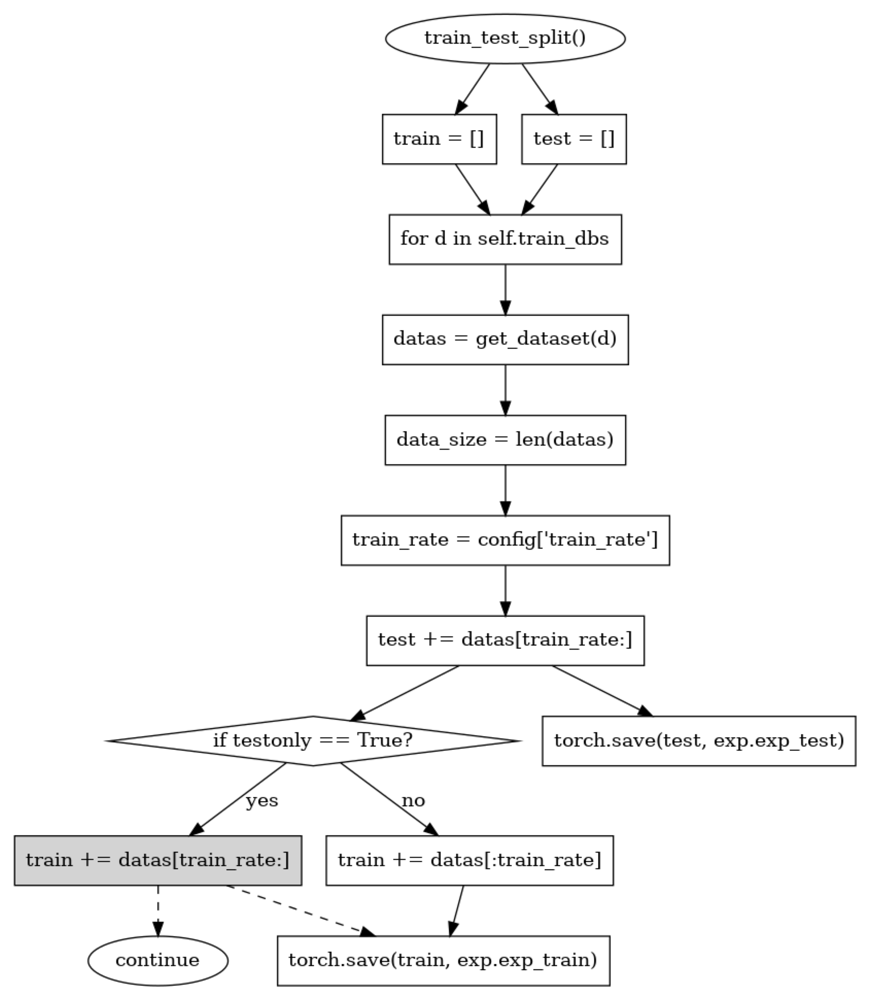
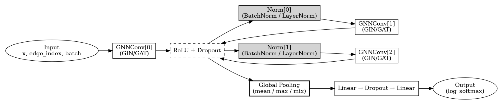

# **MsDroid Code Review - Training**
در یادداشت قبلی فرایند تولید زیرگراف‌ها توضیح داده شد ([لینک](https://github.com/aboyou/DroidMDO/tree/main/MsDroid_Code_Review))، در این یادداشت مدل یادگیری و فرایند آموزش آن توضیح داده خواهد شد.
```python
#!/usr/bin/env python

# -*- encoding: utf-8 -*-

'''
@File    :   train.py
@Time    :   2020/12/26 18:12:18
@Author  :   Yiling He
@Version :   1.0
@Contact :   heyilinge0@gmail.com
@License :   (C)Copyright 2020
@Desc    :   None
'''
# here put the import lib
import sys
import os
import logging
from training import set_train_config, GraphDroid
from graph import generate_graph
from utils import makedirs, set_logger
from main import generate_behavior_subgraph

exp_base = './training/Experiments'
graph_base = f'./training/Graphs'
logger = set_logger(logging.getLogger())

if __name__ == "__main__":
    import argparse
    parser = argparse.ArgumentParser(description='MsDroid Trainer.')
    # Generate behavior subgraphs
    parser.add_argument('--input', '-i', help='APK directory')
    parser.add_argument('--output', '-o', help='output directory', default=f'{sys.path[0]}/Output')
    parser.add_argument('--device', '-d', help='device for model test', default='cpu')
    parser.add_argument('--batch', '-b', help='batch size for model test', default=16)
    parser.add_argument('--label', '-l', help='dataset label: malware(1) / benign(0), unnecessary if only prediction needed.', default=1)
    parser.add_argument('--deepth', '-dp', help='deepth of tpl searching', default=3)
    # Training
    parser.add_argument(
    '--dbs',                   # Argument name
    nargs='+',                 # Accept one or more values as a list
    default=['TestAPK'],       # Default value when no argument is provided
    help='Datasets to train (space-separated).'  # Description of the argument
)
    #parser.add_argument('--dbs', type=list, default=['TestAPK'], help='Datasets to train.')
    parser.add_argument('--tpl', type=bool, default=True, help='TPL simplified subgraphs.')
    parser.add_argument('--hop', type=int, default=2, help='K-hop based subgraphs.')
    parser.add_argument('--batch_size', type=int, default=64, help='Batch size for Dataloader.')
    parser.add_argument('--train_rate', type=float, default=0.8, help='Training rate.')
    parser.add_argument('--norm_op', type=bool, default=False, help='Normalize opcodes feature.')
    parser.add_argument('--mask', type=int, default=-1, help='Mask node features. 0: disable opcodes, 1: disable permission, 2: disable both')
    parser.add_argument('--global_pool', type=str, default='mix', help='Global pooling method for graph classification.')
    parser.add_argument('--lossfunc', type=int, default=0, help='Index of loss function.')
    parser.add_argument('--dimension', type=int, default=128, help='Hidden layer graph embedding dimension.')
    parser.add_argument('--dev', type=int, default=0, help='GPU device id.')
    parser.add_argument('--exp_base', type=str, default=exp_base, help='Dir to put exp results.')
    parser.add_argument('--graph_base', type=str, default=graph_base, help='Dir for graphs.')
    # For Train (`train_and_test`)
    parser.add_argument('--epoch', type=int, default=1, help='Training epoches.')
    parser.add_argument('--force', type=bool, default=False, help='Force new train in exp_base with same config.')
    parser.add_argument('--continue_train', type=bool, default=False, help='Continue to train from last checkpoint.')
    args = parser.parse_args()
    input_dir = args.input
    apk_base = os.path.abspath(os.path.join(input_dir,'../'))
    db_name = input_dir.split(apk_base)[-1].strip('/')
    output_dir = args.output
    makedirs(output_dir)
    label = args.label
    dbs = args.dbs
    tpl = args.tpl
    hop = args.hop
    batch_size = args.batch_size
    train_rate = args.train_rate
    norm_opcode = args.norm_op
    mask = args.mask
    global_pool = args.global_pool
    dimension = args.dimension
    lossfunc = args.lossfunc
    dev = args.dev
    epoch = args.epoch
    force = args.force
    continue_train = args.continue_train
    exp_dir = f'./training/Graphs/{db_name}/HOP_{hop}/TPL_{tpl}'
    if not os.path.exists(f'{exp_dir}/dataset.pt'):
        makedirs('Mappings')
        import time
        T1 = time.process_time()    
        '''
        ./training/Graphs/<db_name>/processed/data_<apk_id>_<subgraph_id>.pt
        '''
        num_apk = generate_behavior_subgraph(apk_base, db_name, output_dir, args.deepth, label, hop=hop, tpl=tpl, training=True, api_map=True)
        T2 = time.process_time()
        print(f'Generate Behavior Subgraphs for {num_apk} APKs: {T2-T1}')
        testonly = True if num_apk==1 else False

    model_config = set_train_config(batch_size=batch_size, train_rate=train_rate, global_pool=global_pool, lossfunc=lossfunc, dimension=dimension)
    graph_droid = GraphDroid(hop, tpl, dbs, norm_opcode=norm_opcode, mask=mask, model_config=model_config, exp_base=args.exp_base, graph_base=args.graph_base, logger=logger)
    graph_droid.train_and_test(epoch, force=force, continue_train=continue_train, dev=dev, testonly=testonly)
```

کد بالا فایل `train.py` است که مسئولیت اجرای آموزش مدل را دارد. در کد بالا در ابتدا شاهد آن هستیم که زیرگراف‌های رفتاری تولید می‌گردند.
```python
num_apk = generate_behavior_subgraph(apk_base, db_name, output_dir, args.deepth, label, hop=hop, tpl=tpl, training=True, api_map=True)
```

در ادامه خط زیر اجرا می‌گردد:
```python
odel_config = set_train_config(batch_size=batch_size, train_rate=train_rate, global_pool=global_pool, lossfunc=lossfunc, dimension=dimension)
```

انتظار می‌رود این تابع پیکربندی تنظیمات آموزش مدل را انجام دهد. در پارامترها، پارامتری به نام `training_rate` وجود دارد. که این پارامتر نسبت داده‌های استفاده شده برای آموزش به اعتبارسنجی/تست را مشخص می‌کند. مثلا `train_rate=0.8` به معنای استفاده از ۸۰٪ داده‌ها برای آموزش و ۲۰٪ باقی‌مانده برای اعتبارسنجی/تست است.
همچنین پارامتر دیگر `global_pool` است. این پارامتر نوع عملیات pooling روی گراف را مشخص می‌کند. همچنین پارامتر `dimension`، اندازه لایه‌های پنهان در مدل گراف امبدینگ را تنظیم می‌کند.

# جریان اجرای فرایند آموزش

.png)

```
                 Start
                    │
      ┌─────────────▼──────────────┐
      │ Initialize GraphDroid Class │
      │ (Loads Configuration)       │
      └─────────────┬──────────────┘
                    │
          Calls `train_and_test()`
                    │
                    ▼
  ┌───────────────────────────────────┐
  │   Initialize Experiment Setup      │
  │   (Check existing training data)   │
  └───────────────────────────────────┘
                    │
      ┌────────────▼──────────────┐
      │ Train-Test Split           │
      │ (Separate Training & Test) │
      └────────────┬──────────────┘
                    │
        Calls `my_train()`
                    │
                    ▼
   ┌───────────────────────────────────┐
   │    Train Model using PyTorch       │
   │    (Run for `num_epoch` epochs)    │
   └───────────────────────────────────┘
                    │
      ┌────────────▼──────────────┐
      │ Save Best Model Weights    │
      └────────────┬──────────────┘
                    │
        Calls `__get_scores()`
                    │
                    ▼
    ┌───────────────────────────────────┐
    │   Evaluate Model Performance       │
    │   (Compute Precision, Recall, F1)  │
    └───────────────────────────────────┘
                    │
      ┌────────────▼──────────────┐
      │  Generate Performance      │
      │  Reports & Save Results    │
      └────────────┬──────────────┘
                    │
       Calls `portability_test()`
                    │
                    ▼
     ┌───────────────────────────────┐
     │  Test on Different Datasets    │
     │  (Generalization Check)        │
     └───────────────────────────────┘
                    │
        Calls `explain_subgraphs()`
                    │
                    ▼
      ┌───────────────────────────────┐
      │ Explain Subgraph Predictions  │
      │ (Find Important APIs & Edges) │
      └───────────────────────────────┘
                    │
      ┌────────────▼──────────────┐
      │  Generate Explanation      │
      │  Reports & Visualizations  │
      └────────────┬──────────────┘
                    │
                Finished 🎉

```

کد کلاس GraphDroid به صورت زیر است:

```python
#!/usr/bin/env python
# -*- encoding: utf-8 -*-
'''
@File    :   train_and_test.py
@Time    :   2020/07/08 20:54:38
@Author  :   Yiling He
@Version :   1.0
@Contact :   heyilinge0@gmail.com
@License :   (C)Copyright 2020
@Desc    :   Main class to train and test.
'''

# here put the import lib
import torch
import random
from torch_geometric.data import DataLoader
from tensorboardX import SummaryWriter
from datetime import datetime
import os
import pandas as pd
from training.model import my_train, my_test
from training.loader import GraphDroidDataset
from training.experiment import Experiment
from training.explainer import GraphExplainer
from training.search_emb import subgraph_cmp

import logging
from utils import add_fh, set_logger, metric2scores
logger = logging.getLogger()

exp_base = './training/Experiments'
graph_base = f'./training/Graphs'


class GraphDroid():
    def __init__(self, hop, tpl, train_dbs, norm_opcode=False, mask=-1, model_config=None, exp_base=exp_base, graph_base=graph_base, logger=logger):
        self.hop = hop
        self.tpl = tpl
        self.train_dbs = train_dbs
        self.norm_opcode = norm_opcode
        self.mask = mask
        self.model_config = model_config if model_config is not None else self.__get_basic_train_config()
        self.exp_base = exp_base
        self.graph_base = graph_base
        self.logger = logger

    def train_and_test(self, num_epoch, force=False, continue_train=False, dev=None, testonly=False, model_dict=None):
        exp = Experiment(set(self.train_dbs), self.tpl, self.hop, self.norm_opcode, self.mask, self.model_config, self.exp_base, self.graph_base, force, continue_train, model_dict)
        if not os.path.exists(exp.exp_train):
            assert not continue_train, 'Can\'t continue: train data not found.' 
            self.__train_test_split(exp, testonly=testonly)

        if num_epoch:
            train_loader = self.__torch_loader(exp.exp_train)
            test_loader = self.__torch_loader(exp.exp_test)
            global_pool = self.model_config['global_pool']
            dimension = self.model_config['dimension']
            lossfunc = self.model_config['lossfunc']
            add_fh(self.logger, exp.log_path)
            
            layer_norm = False#True if self.norm_opcode else False
            model_dict = exp.last_model if model_dict is None else model_dict
            logger.info(f'{num_epoch} epoch training from model dict {model_dict}')
            num_epoch, last_model = my_train(train_loader, test_loader, exp.writer, model_dict, dev=dev, num_epoch=num_epoch, global_pool=global_pool, lossfunc=lossfunc, dimension=dimension, start_epoch=exp.start_epoch, layer_norm=layer_norm)
            
            assert num_epoch !=0, 'no successfully trained epoch'
            exp.set_last_model(num_epoch)
            torch.save(last_model.state_dict(), exp.last_model)

        best_models = self.__prepare_models(exp)
        logger.info(f'Best F1-score models: {best_models}')

        performances = []
        for model_path in best_models:
            try:
                model, tag = exp.load_model(model_path=model_path)
            except RuntimeError:
                logger.exception(f'Failed to load corrupt model {model_path}.')
                os.remove(model_path)
                continue
            try:
                result = self.__get_scores(model, f'{exp.score_path}/{tag}.csv', data_loader=test_loader)
            except UnboundLocalError:
                print(exp.exp_test)
                test_loader = self.__torch_loader(exp.exp_test)
                result = self.__get_scores(model, f'{exp.score_path}/{tag}.csv', data_loader=test_loader)
            try:
                performances.append(tuple([float(i) for i in tag.split('_')]))
            except ValueError:
                performances.append(self.__criterion(result))
        self.__performance_report(exp, performances, 'test_performance')

    def portability_test(self, test_dbs, dev=None, models=None, testonly=False):
        if type(test_dbs) == list:
            test_dbs.sort()
            report_tag = str(test_dbs)
        test_dbs = set(test_dbs)
        train_dbs = set(self.train_dbs)
        if not testonly: assert not test_dbs.issubset(train_dbs)
        exp = Experiment(train_dbs, self.tpl, self.hop, self.norm_opcode, self.mask, self.model_config, self.exp_base, self.graph_base)
        models = self.__prepare_models(exp, models)
        if len(logger.handlers) < 2:
            add_fh(self.logger, exp.log_path)

        performances = []
        for model_path in models:
            logger.info('using model %s', model_path)
            model, tag = exp.load_model(model_path=model_path)
            tb = '+'.join(test_dbs)
            result_path = f'{exp.protest_path}/{tb}_{tag}.csv'
            result = self.__get_scores(model, result_path, dbs=test_dbs)
            performance = self.__criterion(result)
            performances.append(performance)
            logger.info(f'[portability @ {test_dbs}] {model_path}: {performance}')
        self.__performance_report(exp, performances, report_tag)

    def test_specific(self, test_db, batch_size=64, dev=None, emb_=False):
        exp = Experiment(set(self.train_dbs), self.tpl, self.hop, self.norm_opcode, self.mask, self.model_config, self.exp_base, self.graph_base)
        test_dataset = GraphDroidDataset(test_db, self.hop, self.tpl)
        test = test_dataset.get_dataset(norm_opcode=self.norm_opcode, mask=self.mask)
        test_loader = DataLoader(test, batch_size=batch_size)
        model, _ = exp.load_model(model_path=self.__prepare_models(exp)[0])
        if emb_:
            embeddings = my_test(test_loader, model.to(dev), emb_=True, dev=dev)
            return embeddings
        else:
            mapping = test_dataset.get_mapping()
            # api labels
            mapping['prediction'] = my_test(test_loader, model.to(dev), is_validation=True, dev=dev)
            return mapping[mapping.prediction==1].groupby(['graph_id', 'apk'])['api'].apply(lambda x: x.str.cat(sep=','))

    def explain_subgraphs(self, epoch=200, useclass=1, dbs=None, models=None, mode=None, dev=None, **kwargs):
        add_fh(self.logger, 'explaination.log')
        # **kwargs: apk_id, api_id, api_name (apk)
        dbs = dbs if dbs is not None else self.train_dbs
        exp = Experiment(set(self.train_dbs), self.tpl, self.hop, self.norm_opcode, self.mask, self.model_config, self.exp_base, self.graph_base)
        models = self.__prepare_models(exp, models)
        
        if self.norm_opcode:
            mode = 'norm'
        elif self.mask != -1:
            mode = 'mask'
        mask = self.mask

        for m in models:
            model, _ = exp.load_model(model_path=m)
            for d in dbs:
                dataset = GraphDroidDataset(d, self.hop, self.tpl)
                explain(d, dataset, model, mask, epoch, useclass, mode, dev, **kwargs)
    
    def __prepare_models(self, exp, models=None):
        if models is None:
            models = exp.find_best_model()
            if not models: 
                models = [exp.last_model]
        elif type(models) == str:
            models = [models]
        return models
    
    def __train_test_split(self, exp, testonly=False):
        test = []
        train = []
        logger.info('Splitting train test set.')
        for d in self.train_dbs:
            logger.debug(d)
            datas = get_dataset([d], self.hop, self.tpl, self.norm_opcode, self.mask, shuffle=True)
            data_size = len(datas)
            logger.info(f'{d}: {data_size}')
            logger.debug(f'mask: {self.mask}, e.g., {datas[0].data}')
            train_rate = self.model_config['train_rate'] 
            test += datas[int(data_size * train_rate):]
            if testonly: # `TestOnly` Dataset (to avoid ValueError since only one apk exists)
                train  += datas[int(data_size * train_rate):];continue 
            train += datas[:int(data_size * train_rate)] 
        torch.save(train, exp.exp_train)
        torch.save(test, exp.exp_test)

    def __torch_loader(self, data_path, shuffle=True):
        batch_size = self.model_config['batch_size']
        data = torch.load(data_path)
        loader = DataLoader(data, batch_size=batch_size, shuffle=True)
        return loader

    def __get_basic_train_config(self):
        return set_train_config()

    def __performance_report(self, exp, value, col_indexer):
        report = f'{exp.exp_base}/performance.csv'
        configs = pd.read_csv(exp.config_file)
        if os.path.exists(report):
            performance = pd.read_csv(report)
            configs = pd.merge(configs, performance, how='left')
        exp_index = configs[configs.exp_id==exp.exp_id].index
        configs.loc[exp_index, col_indexer] = str(value)
        configs.to_csv(report, index=False)

    def __get_scores(self, model, path, dbs=None, data_loader=None):
        result = pd.DataFrame()
        if data_loader is None:
            scores = []
            labels = []
            pretag = []
            dbname = []
            dbs = dbs if dbs is not None else self.train_dbs
            for d in dbs:
                logger.info(f'testing dataset {d}')
                score, label, plabel = self.__test_dataset(d, model)
                scores += score
                labels += label
                pretag += plabel
                dbname += [d for _ in range(len(label))]
            result['dataset'] = dbname
        else:
            scores, labels, pretag = my_test(data_loader, model, curve=True)
        result['score'] = scores
        result['label'] = labels
        result['prediction'] = pretag
        result.to_csv(path, index=False)
        logger.debug('Scores and labels are saved in %s', path) 
        return result

    def __criterion(self, result):
        TP = len(result[(result.prediction==1) & (result.label==1)])
        FP = len(result[(result.prediction==1) & (result.label==0)])
        TN = len(result[(result.prediction==0) & (result.label==0)])
        FN = len(result[(result.prediction==0) & (result.label==1)])
        return metric2scores(TP, FP, TN, FN)

    def __test_dataset(self, test_db, model, batch_size=64):
        test = GraphDroidDataset(test_db, self.hop, self.tpl).get_dataset(norm_opcode=self.norm_opcode, mask=self.mask)
        test_loader = DataLoader(test, batch_size=batch_size)
        # scores, labels, predict_label
        return my_test(test_loader, model, curve=True)


def set_train_config(batch_size=64, train_rate=0.8, global_pool='mix', lossfunc=0, dimension=128):
    config_dict = {'batch_size': batch_size, 'train_rate': train_rate, 'global_pool': global_pool, 'lossfunc':lossfunc, 'dimension': dimension}
    return config_dict


def get_dataset(dbs, hop=3, tpl=False, norm_opcode=False, mask=-1, shuffle=True, sample=None):
    if type(dbs) == str:
        dbs = [dbs]
    Datasets = []
    for d in dbs:
        data = GraphDroidDataset(d, hop, tpl)
        Datasets += data.get_dataset(norm_opcode=norm_opcode, mask=mask)
    if shuffle:
        random.shuffle(Datasets)
    if sample is not None:
        sample = int(len(Datasets)*sample) if type(sample)==float else sample
        Datasets = random.sample(Datasets, sample)
    return Datasets


def train_test_split(datas, train_rate=0.8, batch_size=64):
    data_size = len(datas)
    train = datas[:int(data_size * train_rate)]
    test = datas[int(data_size * train_rate):]
    train_loader = DataLoader(train, batch_size=batch_size, shuffle=True)
    test_loader = DataLoader(test, batch_size=batch_size, shuffle=True)
    return train_loader, test_loader


def subgraphs_explain(data, model, epoch=500, useclass=1, dev=None, search=False):
    # set `useclass` to 1: only expalin API subgraphs which are predicted as malicoius
    try: # apk
        subgraphs = data.data
    except AttributeError: # api list
        subgraphs = data
    
    suspicious_apis = []

    rbatch = DataLoader(subgraphs, batch_size=1)
    for i in rbatch:
        explainer = GraphExplainer(model, epochs=epoch)
        # edge_index = pd.DataFrame(i.edge_index.numpy().T)
        logger.debug(i.mapping[0])
        try:
            edge_mask, _ = explainer.explain_graph(i.to(dev), useclass=useclass)
            if edge_mask is not None:
                logger.debug(f'[Edge Mask]:\n{edge_mask.cpu().numpy()}')
                # edge_mask = torch.ones(edge_mask.size())
                explainer.visualize_api_subgraph(i, edge_mask)
                suspicious_apis.append(i.mapping[0][i.center[0]])
        except Exception as e:
            logger.error(e)

    logger.info(f'Suspicious APIs: {suspicious_apis}')
    if search:
        mal_cmp = subgraph_cmp(subgraphs, model)
        logger.info(f'Malware API usage similarity (Family level):\n{mal_cmp}')
        return mal_cmp
    else:
        return None


def explain(d, dataset, model, mask=-1, epoch=200, useclass=1, mode=None, dev=None, **kwargs):
    # **kwargs: apk_id, api_id, api_name (apk)
    apk_id = kwargs.get('apk_id')
    api_id = kwargs.get('api_id')
    api_name = kwargs.get('api_name')
    search = kwargs.get('search')

    if api_name is not None:
        logger.info(f'Explaining all API:{api_name} usage in {d}.')
        apk = kwargs.get('apk') or True
        subgraphs = dataset.load_db_apis(api_name, apk, mode, mask=mask)
        if apk: # apk list
            logger.debug('**APK level**')
            graphs, apks = subgraphs
            apk_num = len(apks)
            for i in range(apk_num):
                logger.info(f'{apks[i]}')
                subgraphs_explain(graphs[i], model, epoch, useclass, search=search)
            return
        # subgraphs: api list
        logger.debug(f'**API level**')

    elif api_id is not None:
        assert apk_id is not None
        logger.info(f'Explaining APK:{apk_id} API:{api_id} in {d}.')
        subgraphs = [dataset.load_api(apk_id, api_id, mode, mask=mask)]
    elif apk_id is not None:
        logger.info(f'Explaining APK:{apk_id} in {d}.')
        subgraphs = dataset.load_apk(apk_id, mode, mask=mask)

    mal_cmp = subgraphs_explain(subgraphs, model, epoch, useclass, dev, search=search)
    if mal_cmp:
        mal_cmp.to_csv(f'{apk_id}_explanation_statistics.csv', header=None, index=None)


if __name__ == "__main__":
    import argparse
    parser = argparse.ArgumentParser(description='GraphDroid Model Trainer and Tester.')
    parser.add_argument('--dbs', type=list, default=['TestOnly'], help='Datasets to train.')
    parser.add_argument('--tpl', type=bool, default=True, help='TPL simplified subgraphs.')
    parser.add_argument('--hop', type=int, default=2, help='K-hop based subgraphs.')
    parser.add_argument('--batch_size', type=int, default=64, help='Batch size for Dataloader.')
    parser.add_argument('--train_rate', type=float, default=0.8, help='Training rate.')
    parser.add_argument('--norm_op', type=bool, default=False, help='Normalize opcodes feature.')
    parser.add_argument('--mask', type=int, default=-1, help='Mask node features. 0: disable opcodes, 1: disable permission, 2: disable both')
    parser.add_argument('--global_pool', type=str, default='mix', help='Global pooling method for graph classification.')
    parser.add_argument('--lossfunc', type=int, default=0, help='Index of loss function.')
    parser.add_argument('--dimension', type=int, default=128, help='Hidden layer graph embedding dimension.')
    parser.add_argument('--dev', type=int, default=0, help='GPU device id.')
    parser.add_argument('--exp_base', type=str, default=exp_base, help='Dir to put exp results.')
    parser.add_argument('--graph_base', type=str, default=graph_base, help='Dir for graphs.')
    # For Train (`train_and_test`)
    parser.add_argument('--epoch', type=int, default=1000, help='Training epoches.')
    parser.add_argument('--force', type=bool, default=False, help='Force new train in exp_base with same config.')
    parser.add_argument('--continue_train', type=bool, default=False, help='Continue to train from last checkpoint.')

    args = parser.parse_args()

    dbs = args.dbs
    tpl = args.tpl
    hop = args.hop
    batch_size = args.batch_size
    train_rate = args.train_rate
    norm_opcode = args.norm_op
    mask = args.mask
    global_pool = args.global_pool
    dimension = args.dimension
    lossfunc = args.lossfunc
    dev = args.dev
    epoch = args.epoch
    force = args.force
    continue_train = args.continue_train

    hop = 2
    tpl = True
    # dbs = ['Drebin', 'Benign_Old1', 'Benign_Old2', 'Benign_Old3', 'Benign_Old4', 'amd', 'Benign_New1', 'Benign_New2', 'Benign_New3', 'Benign_New4']
    dbs = ['Drebin', 'Benign_Old']

    model_config = set_train_config(batch_size=batch_size, train_rate=train_rate, global_pool=global_pool, lossfunc=lossfunc, dimension=dimension)
    graph_droid = GraphDroid(hop, tpl, dbs, norm_opcode=norm_opcode, mask=mask, model_config=model_config, exp_base=args.exp_base, graph_base=args.graph_base)
    
    # (CUDA out of memory solution) Linux command: `export CUDA_VISIBLE_DEVICES=2,3`
    # or uncomment the following line
    # os.environ["CUDA_VISIBLE_DEVICES"] = "1"
    # graph_droid.train_and_test(epoch, force=force, continue_train=continue_train, dev=dev) #, testonly=True #, model_dict="/opt/data/E0/GraphDroid/GraphNN_bakup/experiments/20201024-182905/models/0"
    
    # graph_droid.portability_test(['amd'], dev=dev) # dbs, testonly=True

    """
    Case Study 1: why `Reflection` good?
    Drebin/Adsms/54ece852176437e02ce2400e48c5545d32a5d69adee4a66a337ba98c67aea94e
    """
    # graph_droid.explain_subgraphs(apk_id=1469, api_id=2, epoch=500, dbs=['Drebin'])
    # graph_droid.explain_subgraphs(apk_id=1233, api_id=2, epoch=500, dbs=['Drebin_Reflection'])
    """
    Case Study 2: COVID themed (2020)
    malware_vt5: 34952977658d3ef094a505f51de73c4902265b856ec90d164a34ae178474558f   # 136
    """
    # graph_droid.explain_subgraphs(apk_id=136, epoch=500, dbs=['malware_vt5'], search=True)

    """Drebin (4 node types)"""
    graph_droid.explain_subgraphs(apk_id=5552, api_id=2, epoch=500, dbs=['Drebin'])

    # graph_droid.test_specific('malware_vt5', dev=dev, batch_size=batch_size).to_csv('malware_vt5.csv')
    # """amd-0~amd-2"""
    # for i in range(3):
    #     db = 'amd-' + str(i)
    #     graph_droid.test_specific(db, dev=dev, batch_size=batch_size).to_csv('%s.csv'%db)

    '''
    Set up malware db for 3rd level explaination.
    '''
    # for i in ['amd-0', 'amd-1', 'amd-2']:
    #     logger.debug(i)
    #     embeddings = graph_droid.test_specific(i, dev=dev, batch_size=batch_size, emb_=True)
    #     logger.debug(f'Embedding @ {i}. e.g., \n{embeddings[0]}')
    #     torch.save(embeddings, f"/opt/data/E0/GraphDroid/helper/AMD_embeddings/{i}.pt")

```

# اولیه‌سازی آموزش (Initialization)
```
                      ┌──────────────────────────────┐
                      │  Initialize GraphDroid Class │
                      └──────────────┬──────────────┘
                                     │
      ┌──────────────────────────────▼─────────────────────────────┐
      │ Load Graph Configuration Parameters                        │
      │ - hop, tpl, train_dbs, norm_opcode, mask                   │
      └──────────────────────────────┬─────────────────────────────┘
                                     │
      ┌──────────────────────────────▼─────────────────────────────┐
      │ Set Up Model Training Configurations                        │
      │ - Load model_config or set default via __get_basic_train_config() │
      └──────────────────────────────┬─────────────────────────────┘
                                     │
      ┌──────────────────────────────▼─────────────────────────────┐
      │ Define Experiment & Graph Paths                            │
      │ - exp_base, graph_base                                     │
      └──────────────────────────────┬─────────────────────────────┘
                                     │
      ┌──────────────────────────────▼─────────────────────────────┐
      │ Set Up Logger                                                │
      └─────────────────────────────────────────────────────────────┘

```


# قدم دوم: تنظیمات experiment

کلاس `Experiment` **تنظیمات آموزش و آزمون** را مدیریت می‌کند تا: 

✅ **آزمایش‌ها به‌درستی ردیابی شوند** (جلوگیری از تکرار آزمایش‌ها).  
✅ **نقاط بازرسی آموزش حفظ شوند** (ادامه آموزش در صورت نیاز).  
✅ **مسیرهای ذخیره‌سازی سازمان‌یافته باشند** (لاگ‌ها، مدل‌ها، نتایج).

## مقداردهی اولیه تنظیمات آزمایش
```python
class Experiment():
    def __init__(self, trained_db, tpl, hop, norm_opcode, mask, model_config, exp_base=exp_base, graph_base=graph_base, force=False, continue_train=False, model_dict=None):
```

- اطلاعات **مجموعه داده، تنظیمات گراف و پارامترهای آموزش** را ذخیره می‌کند.
- بررسی می‌کند که آیا **آزمایشی مشابه قبلاً اجرا شده است**.
- اگر `continue_train=True` باشد، آموزش **از نقطه‌ای که متوقف شده بود ادامه می‌یابد**.

## تنظیم مسیرهای ذخیره‌سازی (`()set_paths__`)
```python
def __set_paths(self):
    makedirs(self.exp_base)
    self.config_file = f'{self.exp_base}/exp_configs.csv'
    columns = ['exp_id', 'trained_db', 'tpl', 'hop', 'norm_opcode', 'mask', 'model_config']
    if not os.path.exists(self.config_file):
        (pd.DataFrame([], columns=columns)).to_csv(self.config_file, index=False)
```

- اطمینان حاصل می‌کند که مسیرهای آزمایش (`exp_base`) ایجاد شده‌اند.
- یک **فایل CSV (`exp_configs.csv`)** برای ذخیره تنظیمات آزمایش‌ها ایجاد می‌کند.

## بررسی وجود آزمایش مشابه (()get_exp_id__`)

```python
def __get_exp_id(self):
    configs = pd.read_csv(self.config_file)
    exp_id = None
    for _, v in configs.iterrows():
        match = (eval(v.trained_db) == self.trained_db) & (v.tpl == self.tpl) & (v.hop == self.hop) & (v.norm_opcode == self.norm_opcode) & (v['mask'] == self.mask) & (eval(v.model_config) == self.model_config)
        if match:
            exp_id = v.exp_id
            break
    if exp_id is not None:
        self.exp_id = exp_id
```

- فایل `exp_configs.csv` را خوانده و بررسی می‌کند که آیا **آزمایشی مشابه قبلاً اجرا شده است**.
- اگر آزمایش موجود باشد، مقدار **`exp_id`** را تنظیم می‌کند.

## ایجاد آزمایش جدید در صورت عدم وجود قبلی
```python
if self.exp_id is None or (self.force and not self.continue_train):
    self.__create_exp(columns)
```

- اگر آزمایش قبلی پیدا نشود، یک **آزمایش جدید ایجاد می‌شود**.
- اگر `force=True` باشد، **آزمایش قبلی بازنویسی می‌شود**.

## اختصاص شناسه آزمایش (()create_exp__`)
```python
def __create_exp(self, columns):
    setup_logger.info('Creating a new experiment.')
    self.exp_id = datetime.now().strftime("%Y%m%d-%H%M%S")  # شناسه یکتا
    configs = pd.DataFrame([[self.exp_id, self.trained_db, self.tpl, self.hop, self.norm_opcode, self.mask, self.model_config]], columns=columns)
    configs.to_csv(self.config_file, mode='a', header=False, index=False)
```

- یک **شناسه یکتا بر اساس زمان ایجاد می‌کند**.
- اطلاعات آزمایش جدید را **در `exp_configs.csv` ذخیره می‌کند**.

## تنظیم مسیرهای ذخیره داده‌های آموزش و آزمون
```python
exp_data = f'{self.exp_base}/{self.exp_id}/TrainTest'
makedirs(exp_data)
self.exp_train = f'{exp_data}/train.pt'
self.exp_test = f'{exp_data}/test.pt'
self.log_path = f'{self.exp_base}/{self.exp_id}/exp_log.log'
```

مسیرهایی را برای ذخیره:

- **مجموعه آموزش و آزمون** (`train.pt`, `test.pt`)
- **لاگ‌های آزمایش** (`exp_log.log`) تنظیم می‌کند.

## مدیریت مسیرهای ذخیره مدل
```python
self.model_path = f'{self.exp_base}/{self.exp_id}/models'
self.get_models(last=True, model_dict=self.model_dict)
if self.continue_train:
    if self.last_model.split('/')[-1] != '0':
        self.start_epoch = self.__epoch_from_log() + 1
    else:
        clear = True
        ori_log = f'{self.exp_base}/{self.exp_id}/exp_log.log'
        if os.path.exists(ori_log):
            os.remove(ori_log)
    self.__get_train_paths(clear=clear)
```

- یک مسیر برای **ذخیره مدل‌های آموزش‌دیده‌شده** ایجاد می‌کند.
- اگر `continue_train=True` باشد، **آموزش از آخرین نقطه‌ای که متوقف شده بود ادامه می‌یابد**.


# قدم سوم: تقسیم داده آموزش و آزمون (`__train_test_split`)

در صورتی که فایل‌های train,pt و test.pt وجود نداشته باشد، این قسمت اجرا خواهد شد.
بعد از **راه‌اندازی آزمایش (Experiment Setup)**، سیستم **مجموعه داده را به دو بخش آموزش و آزمون تقسیم می‌کند** تا مدل برای آموزش آماده شود.
```python
def __train_test_split(self, exp, testonly=False):
    test = []
    train = []
    logger.info('Splitting train test set.')

    for d in self.train_dbs:
        logger.debug(d)
        datas = get_dataset([d], self.hop, self.tpl, self.norm_opcode, self.mask, shuffle=True)
        data_size = len(datas)
        logger.info(f'{d}: {data_size}')
        logger.debug(f'mask: {self.mask}, e.g., {datas[0].data}')

        train_rate = self.model_config['train_rate'] 
        test += datas[int(data_size * train_rate):]
        
        if testonly:  # اگر `testonly=True` باشد، همه داده‌ها برای تست استفاده می‌شوند
            train += datas[int(data_size * train_rate):]
            continue  

        train += datas[:int(data_size * train_rate)]  # تخصیص داده‌های آموزش

    torch.save(train, exp.exp_train)
    torch.save(test, exp.exp_test)
```

## پردازش هر مجموعه داده آموزشی
```python
for d in self.train_dbs:
    logger.debug(d)
    datas = get_dataset([d], self.hop, self.tpl, self.norm_opcode, self.mask, shuffle=True)
```
- روی **هر مجموعه داده** در `self.train_dbs` حلقه می‌زند.
- تابع **`get_dataset()`** را صدا می‌زند که:
    - **مجموعه داده را بارگیری می‌کند** (`d`).
    - **ویژگی‌های لازم را استخراج می‌کند**.
    - **داده‌ها را به‌صورت تصادفی مرتب می‌کند**.

## تخصیص داده‌های آزمون
```python
test += datas[int(data_size * train_rate):]
```
**آخرین بخش از مجموعه داده** (20%) به‌عنوان **داده‌های تست** انتخاب می‌شود.
## ✅ تعریف دقیق تابع `get_dataset`

```python
def get_dataset(dbs, hop=3, tpl=False, norm_opcode=False, mask=-1, shuffle=True, sample=None):
    if type(dbs) == str:
        dbs = [dbs]
    Datasets = []
    for d in dbs:
        data = GraphDroidDataset(d, hop, tpl)
        Datasets += data.get_dataset(norm_opcode=norm_opcode, mask=mask)
    if shuffle:
        random.shuffle(Datasets)
    if sample is not None:
        sample = int(len(Datasets)*sample) if type(sample)==float else sample
        Datasets = random.sample(Datasets, sample)
    return Datasets
```
## 🧠 عملکرد مرحله‌به‌مرحله

|گام|توضیح|
|---|---|
|1️⃣|اگر `dbs` یک رشته باشد، به لیست تبدیل می‌شود.|
|2️⃣|برای هر دیتابیس، یک شی از `GraphDroidDataset` ساخته می‌شود.|
|3️⃣|با متد `get_dataset()` گراف‌ها (نوع `Data`) از دیتابیس استخراج می‌شوند.|
|4️⃣|اگر `shuffle=True`، ترتیب داده‌ها تصادفی می‌شود.|
|5️⃣|اگر `sample` مشخص شده باشد، به اندازه آن، نمونه‌ها از داده‌ها انتخاب می‌شوند.|
|✅|لیست نهایی گراف‌ها برگردانده می‌شود.|

---
# قدم چهارم: آموزش مدل
این خط کد:

```python
num_epoch, last_model = my_train(train_loader, test_loader, exp.writer, model_dict,
                                 dev=dev, num_epoch=num_epoch, global_pool=global_pool,
                                 lossfunc=lossfunc, dimension=dimension,
                                 start_epoch=exp.start_epoch, layer_norm=layer_norm)
```

وظیفه‌ی **آموزش مدل گرافی (GNN)** را دارد و تابع `my_train(...)` را صدا می‌زند که یکی از توابع کلیدی در آموزش مدل GraphDroid است.

---

## ✅ وظیفه کلی:

تابع `my_train(...)`:

- مدل را با استفاده از داده‌های `train_loader` آموزش می‌دهد.
- در هر epoch با `test_loader` ارزیابی انجام می‌دهد.
- بهترین مدل را ذخیره کرده و برمی‌گرداند.
- مقدار نهایی `epoch` و آخرین نسخه مدل را باز می‌گرداند.

---
## 🧠 توضیح آرگومان‌ها:

| آرگومان        | توضیح                                                    |
| -------------- | -------------------------------------------------------- |
| `train_loader` | داده‌های آموزش (لیستی از گراف‌های API)                   |
| `test_loader`  | داده‌های تست برای ارزیابی در طول آموزش                   |
| `exp.writer`   | شیء `SummaryWriter` برای ثبت لاگ‌های TensorBoard         |
| `model_dict`   | مدل اولیه (یا مدل ذخیره‌شده از قبل برای ادامه آموزش)     |
| `dev`          | شماره دستگاه GPU                                         |
| `num_epoch`    | تعداد epochهای موردنظر برای آموزش                        |
| `global_pool`  | روش جمع‌بندی ویژگی گره‌ها (مثلاً mean، max، یا mix)      |
| `lossfunc`     | نوع تابع خطا (مثلاً CrossEntropy)                        |
| `dimension`    | تعداد نورون‌های لایه embedding                           |
| `start_epoch`  | در صورت ادامه آموزش، از این epoch شروع می‌شود            |
| `layer_norm`   | اگر `True` باشد، normalization روی ویژگی‌ها اعمال می‌شود |

---
## 🟢 خروجی‌ها:

| خروجی        | توضیح                                                              |
| ------------ | ------------------------------------------------------------------ |
| `num_epoch`  | تعداد epochهایی که واقعاً اجرا شدند (ممکن است early-stopping باشد) |
| `last_model` | شیء مدل PyTorch آموزش‌دیده (آخرین وضعیت)                           |

---
## 📦 مثال عملی:

فرض کنیم داریم ۱۰۰۰ گراف API، مدل ما یک GCN است و می‌خواهیم آن را روی GPU شماره 0 برای 200 epoch آموزش دهیم. در این صورت:

- `train_loader` شامل گراف‌هایی مثل `Data(x=..., edge_index=...)` خواهد بود.
    
- در طول آموزش، هر epoch شامل:
    - فوروارد گراف‌ها
    - محاسبه loss
    - backpropagation
    - ارزیابی روی `test_loader`
- `last_model` در پایان آماده ذخیره و استفاده در تست است.

## لایۀ GNNStack

